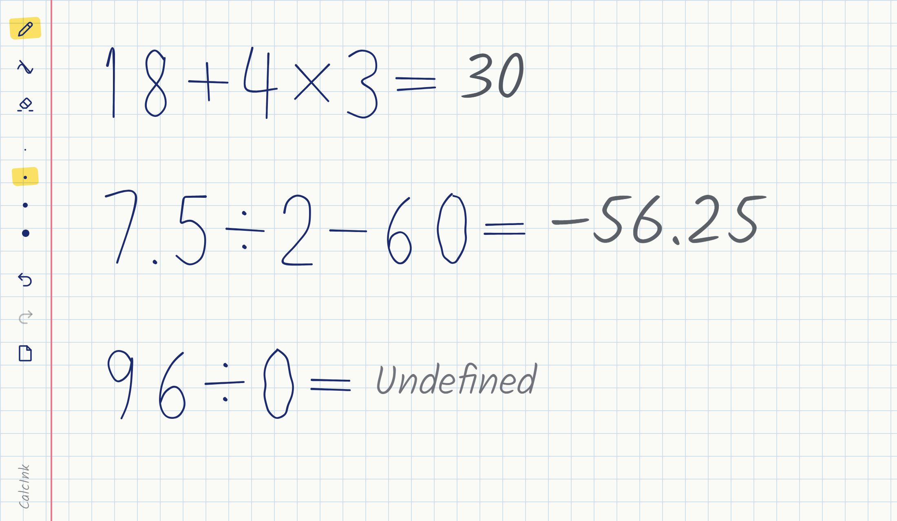

# CalcInk

A notebook page that does your arithmetic. Write an expression by hand, end it with `=`, and the
answer is pencilled in beside it. Change the expression and the answer follows.

Everything runs in the browser: stroke capture, handwriting recognition and evaluation. There is
no server, and nothing you write leaves your device. After the first visit it works with no
network connection at all.



Built for the Inter IIT Tech Meet 15.0 Bootcamp, Phase 1 Software problem statement
([docs/problem-statement.pdf](docs/problem-statement.pdf)).

**Live demo:** _link to be added on deployment_

## Quick start

Requires Node.js 20.19 or later (22.12 or later on the 22 line).

```bash
npm install
npm run dev
```

Then open the address Vite prints, normally <http://localhost:5173>.

To try the production build, including offline support:

```bash
npm run build
npm run preview
```

## Using it

Write with a mouse, a finger or a stylus. Finish an expression with `=` and pause; the answer
appears about a third of a second after you stop writing.

- Digits `0`–`9`, the operators `+` `−` `×` `÷`, and the decimal point are recognised.
- Standard precedence applies: `18 + 4 × 3 =` gives 30.
- Negative numbers work: `3 × −2 =` gives −6.
- Dividing by zero gives `Undefined`.
- Sums can also be written as a column: numbers one under another, the operator at the left,
  and a line drawn underneath. The answer is written under the line.
- A line does not have to be level. Writing that climbs, or is turned as a whole, is read up to
  about 30° either way, and the answer is written along the line.
- Write as many equations on the page as you like. Each is worked out separately.
- Need more room? Scroll to the end, past the last page, and a + appears. Keep scrolling, or press
  it, and a new page is added. On a touchscreen, scroll with two fingers; one finger writes.
- Erase a number and write another in its place, and the answer updates.

Your writing is ink. Everything the notebook works out is drawn in pencil. When it is unsure of a
symbol it read, the answer is written more faintly and the doubtful symbol gets a dotted line
beneath it. When an expression does not make sense, the symbol at fault is marked and a note says
why; nothing is written where the answer would go.

| Tool, in the margin                              | Key      |
| ------------------------------------------------ | -------- |
| Pen                                              | `P`      |
| Eraser, rubbing out whole strokes                | `E`      |
| Eraser, rubbing out only the part it passes over | `R`      |
| Lasso, to select writing and move or delete it   | `L`      |
| Make the pen or the eraser thicker or thinner    | `[` `]`  |
| Undo                                             | `Ctrl+Z` |
| Redo                                             | `Ctrl+Y` |
| Clear all pages (can be undone)                  |          |

Press a tool once to pick it up, and press it again for its menu. The pen's menu sets its width,
from 1.5 to 12 px, and its colour, from six inks. The eraser's menu sets the size of its tip, from
8 to 80 px, and whether it rubs out whole strokes or only the part it passes over. Both show the
size you are choosing at its true size. The eraser end of a stylus erases without changing tool,
and a hand resting on the screen while you write with a stylus is ignored.

With the lasso, draw a loop round some writing to select it. Drag the selection to move it, its
answer with it, or press Delete. Tap elsewhere to let it go.

To see what the notebook read, tap any number or sign of a sum, or its answer. Each symbol is
labelled with what it was read as; a fainter label means it was unsure. Tap again to hide them.

## How it works

Ink is kept as vectors from the first pointer event to the last step of recognition.

1. **Capture.** Pointer events become immutable strokes, drawn on a canvas scaled for the device
   pixel ratio.
2. **Layout.** After 350 ms of quiet, strokes are grouped into lines and then into symbols using
   their bounding boxes.
3. **Recognise.** In a Web Worker, each new symbol is redrawn from its coordinates into a 64×64
   image and classified by a small convolutional network running on WebAssembly. For a digit, two
   much smaller networks vote as well.
4. **Interpret.** The model's probabilities are combined with stroke geometry. The decimal point
   is decided by geometry alone.
5. **Evaluate.** A recursive-descent parser turns the symbols into a result. No `eval`.
6. **Draw.** The answer is written on an overlay canvas next to the `=`.

[docs/ARCHITECTURE.md](docs/ARCHITECTURE.md) covers each step, the reasoning behind it, and the
measured performance and memory figures.

## Model attribution

Symbols are recognised by pre-trained convolutional networks that ship with the app. We did not
train any of them. One main model reads all fifteen symbols; two small ones help it tell the digits
apart.

|              |                                                                                                                                                                 |
| ------------ | --------------------------------------------------------------------------------------------------------------------------------------------------------------- |
| Model        | `cnn_aug` from [altynbk/handwritten-math-recognition](https://github.com/altynbk/handwritten-math-recognition), commit `3d91c0c`                                |
| Licence      | MIT, copyright Altynbek Kabiyev. Full text in [public/models/LICENSE.txt](public/models/LICENSE.txt)                                                            |
| Architecture | 4 × (3×3 convolution, batch normalisation, 2×2 max-pool) with 32, 64, 128 and 256 filters, then global average pooling and a 15-way softmax. 393,615 parameters |
| Input        | One symbol as a 64×64 greyscale image                                                                                                                           |
| Output       | Probabilities for `0`–`9`, `+`, `−`, `×`, `÷` and `=`. The decimal point is identified from stroke geometry                                                     |
| Bundled file | [public/models/symbol-classifier.onnx](public/models/symbol-classifier.onnx), 1.58 MB: the upstream weights converted from Keras to ONNX, unchanged             |
| Accuracy     | 99.44% on the upstream held-out test set (1,599 of 1,608), reproduced by us after conversion                                                                    |

Two digit helpers vote with it on which digit a digit is. On 3,498 digits written by people none
of the models has seen, the main model alone reads 93.5% and the three together 97.8%.

| Helper                | Source                                                                                           | Licence             | Size                       | Bundled as                                                                                                                       |
| --------------------- | ------------------------------------------------------------------------------------------------ | ------------------- | -------------------------- | -------------------------------------------------------------------------------------------------------------------------------- |
| mathex `mathex_v1.h5` | [devansh9837/mathex](https://github.com/devansh9837/mathex), commit `7341d9e`                    | MIT                 | 60,137 parameters, 0.24 MB | [digit-helper-mathex.onnx](public/models/digit-helper-mathex.onnx): the upstream weights converted from Keras to ONNX, unchanged |
| `mnist-12`            | [ONNX Model Zoo](https://github.com/onnx/models/tree/main/validated/vision/classification/mnist) | MIT, per its README | 5,998 parameters, 0.03 MB  | [digit-helper-mnist.onnx](public/models/digit-helper-mnist.onnx): the upstream file, byte for byte                               |

Why these models, what else we evaluated, how the vote works and a note on the provenance of the
training data are in [docs/ARCHITECTURE.md](docs/ARCHITECTURE.md#2-model-selection). The
conversion and benchmark scripts are in [scripts/model](scripts/model).

## Scripts

| Command               | What it does                                                                            |
| --------------------- | --------------------------------------------------------------------------------------- |
| `npm run dev`         | Start the dev server                                                                    |
| `npm run build`       | Type-check, then build to `dist/`                                                       |
| `npm run preview`     | Serve the production build locally                                                      |
| `npm test`            | Run the 641 unit and integration tests once                                             |
| `npm run typecheck`   | Type-check without building                                                             |
| `npm run lint`        | Lint the source. Fails on `eval` or `new Function`                                      |
| `npm run format`      | Format the source with Prettier                                                         |
| `npm run capture`     | Serve a build that can save handwriting (below)                                         |
| `npm run eval:digits` | Measure recognition on real pen-written digits ([scripts/eval](scripts/eval/README.md)) |

### Collecting real handwriting

`npm run capture` serves a special build on the local network, on port 5185. Open it on a tablet
on the same network and it shows one extra button, **Report a misread**. Pressing it asks what
the page was meant to say, then saves the ink, what was read and that answer as a JSON file in
`captures/` on the development machine. A saved page can be replayed through layout and
recognition exactly, which is how a misread becomes a regression test.

This is a development aid. The button and the code behind it are not in the production build,
and the app itself never sends anything anywhere.

## Project layout

```
src/
  ink/           strokes, stroke store, undo/redo, erasers
  canvas/        coordinate conversion, canvas layers, pointer input, rendering
  layout/        grouping strokes into lines and symbols
  recognition/   rasteriser, worker, model adapter, fusing model output with geometry
  math/          tokenizer, parser, evaluator, number formatting
  app/           the pipeline connecting the stages; scheduling; app shell
  ui/            toolbar, answer overlay
  dev/           saving a page of handwriting for study (not in the production build)
  styles/        the notebook page
public/models/   the ONNX model and its licence
scripts/model/   model conversion and benchmark scripts (Python; not needed to run the app)
scripts/dev/     the dev-server route that receives saved pages
tests/           mirrors src/, plus synthetic-handwriting fixtures
docs/            architecture document, problem statement
```

## Deploying

`npm run build` produces a static site in `dist/` that can be served from any static host. The
build uses relative paths, so it works at a domain root and under a sub-path without changes.

The host must serve over HTTPS, which service workers require. No special response headers are
needed.

## Third-party software

| Component                                                                                                   | Licence | Used for                    |
| ----------------------------------------------------------------------------------------------------------- | ------- | --------------------------- |
| [onnxruntime-web](https://github.com/microsoft/onnxruntime)                                                 | MIT     | Running the model on WASM   |
| [perfect-freehand](https://github.com/steveruizok/perfect-freehand)                                         | MIT     | Smoothing strokes           |
| Kalam by Indian Type Foundry, via `@fontsource/kalam`                                                       | OFL-1.1 | The pencil handwriting face |
| [vite-plugin-pwa](https://github.com/vite-pwa/vite-plugin-pwa) and Workbox                                  | MIT     | The service worker          |
| [altynbk/handwritten-math-recognition](https://github.com/altynbk/handwritten-math-recognition)             | MIT     | The recognition model       |
| [devansh9837/mathex](https://github.com/devansh9837/mathex)                                                 | MIT     | A digit helper model        |
| [ONNX Model Zoo `mnist-12`](https://github.com/onnx/models/tree/main/validated/vision/classification/mnist) | MIT     | A digit helper model        |

The font's licence is distributed with the app at
[public/licenses/Kalam-OFL.txt](public/licenses/Kalam-OFL.txt).
