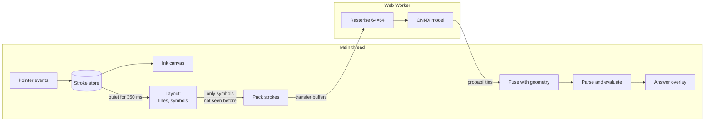

# CalcInk architecture

This document explains how CalcInk is built and why. Every number in it was measured on this
codebase, and the section that quotes a number says how.

1. [Overview](#1-overview)
2. [Model selection](#2-model-selection)
3. [From strokes to an answer](#3-from-strokes-to-an-answer)
4. [Drawing](#4-drawing)
5. [Keeping the main thread free](#5-keeping-the-main-thread-free)
6. [The math engine](#6-the-math-engine)
7. [Working offline](#7-working-offline)
8. [Measured performance and memory](#8-measured-performance-and-memory)
9. [Tests](#9-tests)
10. [Limitations](#10-limitations)

## 1. Overview

CalcInk is a notebook page that does arithmetic. You write an expression by hand, end it with
`=`, and the answer is pencilled in beside it. Change the expression and the answer follows.
Nothing leaves the device: capture, recognition and evaluation all run in the browser.

The design follows from one decision: **ink is kept as vectors from the first pointer event to the
last step of recognition.** A stroke is a list of points, never a patch of pixels. Everything else
builds on that.

- Rendering scales the same points to any device pixel ratio, so ink is crisp on every screen.
- Erasing cuts strokes geometrically, so what is left is still exact stroke data.
- Grouping strokes into symbols is done with bounding boxes, with no image segmentation.
- The model's input is redrawn from the points at exactly the size and thickness the model was
  trained on, whatever size the user wrote at.



The code is organised the same way. Each folder is one stage and depends only on the ones before
it.

| Folder            | Responsibility                                                   | Browser APIs? |
| ----------------- | ---------------------------------------------------------------- | ------------- |
| `src/ink`         | Strokes, the stroke store, undo/redo, both erasers               | No            |
| `src/canvas`      | Coordinate conversion, canvas layers, pointer input, rendering   | Yes           |
| `src/layout`      | Grouping strokes into lines and symbols                          | No            |
| `src/recognition` | Rasterising, the worker, the model adapter, fusing with geometry | Worker only   |
| `src/math`        | Tokenizer, parser, evaluator, number formatting                  | No            |
| `src/app`         | The pipeline that connects the stages; scheduling; the app shell | Timers        |
| `src/ui`          | Toolbar and the answer overlay                                   | Yes           |

Four of the seven are pure functions with no browser dependency. That is deliberate: it is what
lets the eraser geometry, the layout rules, the rasteriser and the parser be tested exhaustively
in Node, and it is why the recognition path can be tested end to end against the real model
without opening a browser.

## 2. Model selection

### What the model has to do

The problem statement asks for recognition of 16 symbols (`0`–`9`, `+`, `−`, `×`, `÷`, `.`, `=`),
powered by an existing open-source pre-trained model that runs entirely in the browser. From that
and from the grading rubric we derived five requirements:

1. **Coverage.** As many of the 16 symbols as possible come from the model itself.
2. **Permissive licence.** MIT, Apache-2.0 or BSD, verified from the licence file in the source
   repository rather than from a badge or a description.
3. **Small.** The model is precached for offline use, so every megabyte is paid on first load.
4. **Fast on CPU.** It runs under WebAssembly in a worker. An equation of about eight symbols
   should be classified in well under 100 ms.
5. **Accurate on canvas ink.** Our input is strokes drawn with a mouse, finger or stylus. That is
   not the same distribution as scanned paper, and models trained on one do not automatically work
   on the other.

### Approach: classify symbols, not whole expressions

There are two families of model for this task. End-to-end models take an image of a whole
expression and emit LaTeX. Symbol classifiers take one isolated symbol and emit a label, leaving
segmentation and ordering to the application.

We chose a symbol classifier. Our ink is stored as vector strokes with known positions, so the
hard part of the end-to-end problem (finding and ordering symbols in a bitmap) is something we can
do exactly, with geometry, for free. The expressions are a flat, one-line grammar with no
fractions or exponents, so we do not need a model to recover two-dimensional structure. And a
classifier's output is a probability per symbol, which is what the confidence indicator and the
re-evaluation cache both need. The end-to-end models we found (TrOCR-based math recognisers and
image-to-LaTeX transformers) are also autoregressive encoder–decoders that are far larger than a
small CNN, emit LaTeX that would need a second parser, and in several cases carry non-commercial
licences. We did not evaluate them further.

### Candidates

We searched Hugging Face, GitHub, the ONNX Model Zoo and Kaggle, kept every candidate that shipped
weights under a permissive licence, and measured them ourselves.

|                                 | Chosen: **altynbk** `cnn_aug`                                                                   | **Sagyam** `19_class`                                 | **kbss0000**                                                                                    | **mathex**                                                  | **ONNX Zoo** `mnist-12`                                     |
| ------------------------------- | ----------------------------------------------------------------------------------------------- | ----------------------------------------------------- | ----------------------------------------------------------------------------------------------- | ----------------------------------------------------------- | ----------------------------------------------------------- |
| Source                          | [altynbk/handwritten-math-recognition](https://github.com/altynbk/handwritten-math-recognition) | [Sagyam/hesv-api](https://github.com/Sagyam/hesv-api) | [kbss0000/Handwritten-Equation-Solver](https://github.com/kbss0000/Handwritten-Equation-Solver) | [devansh9837/mathex](https://github.com/devansh9837/mathex) | [onnx/models](https://huggingface.co/onnxmodelzoo/mnist-12) |
| Licence                         | MIT                                                                                             | MIT                                                   | MIT                                                                                             | MIT                                                         | MIT                                                         |
| Architecture                    | 4 × (Conv 3×3, BatchNorm, MaxPool), global average pool, dense                                  | MobileNetV2 backbone, dense 1024, dense               | 3 × (Conv 3×3, MaxPool), 3 dense                                                                | 2 × (Conv, MaxPool), 3 dense                                | 2 × (Conv, MaxPool), 1 dense                                |
| Parameters                      | 393,615                                                                                         | 3,594,323                                             | 162,418                                                                                         | 60,137                                                      | 5,998                                                       |
| Input                           | 64×64 grey                                                                                      | 100×100 RGB                                           | 32×32 grey                                                                                      | 28×28 grey                                                  | 28×28 grey                                                  |
| Our symbols covered             | **15 of 16** (all but `.`)                                                                      | **16 of 16**, plus `x y z`                            | 14 (no `=`, `.`)                                                                                | 13 (no `÷`, `=`, `.`)                                       | 10 (digits only)                                            |
| Size as ONNX                    | **1.58 MB**                                                                                     | 14.4 MB ¹                                             | 0.65 MB                                                                                         | 0.24 MB                                                     | 0.03 MB                                                     |
| WASM latency, 1 symbol ²        | 3.7 ms                                                                                          | not measured ¹                                        | 1.3 ms                                                                                          | 0.6 ms                                                      | 0.6 ms                                                      |
| WASM latency, 8 symbols ²       | 29 ms                                                                                           | not measured ¹                                        | 12 ms                                                                                           | 4.3 ms                                                      | 4.5 ms ³                                                    |
| Accuracy claimed by author      | 99.44%                                                                                          | none published                                        | "~95%"                                                                                          | 96.67%                                                      | 98.9% on MNIST                                              |
| **Accuracy on our benchmark ⁴** | **99.4%**                                                                                       | 98.2%                                                 | 84.5%                                                                                           | 64.7%                                                       | 57.4%                                                       |
| … digits only                   | 99.4%                                                                                           | 97.5%                                                 | 99.4% ⁵                                                                                         | 72.7%                                                       | 91.3%                                                       |
| … operators it supports         | 99.5%                                                                                           | 99.3%                                                 | 74.5%                                                                                           | 86.2%                                                       | n/a                                                         |

¹ Parameters × 4 bytes. We did not convert this model to ONNX, so there is no WASM timing. Its
compute per symbol is of the same order as the chosen model (roughly 60 M multiply-adds at
100×100, scaled from MobileNetV2's published figure at 224×224, against 57.8 M for the chosen
model), so we would expect similar latency at nine times the download.

² `onnxruntime-web` 1.30.0, WASM backend with SIMD, one thread, median of 100 runs after warm-up,
on an Intel Core i5-12450HX under Node 22. This is the same WebAssembly binary the browser loads.

³ This model has a fixed batch size of one, so eight symbols are eight separate calls.

⁴ The benchmark is the 1,608-image held-out test split of the altynbk repository: canvas-drawn
digits and operators, 15 classes. A symbol the model has no class for counts as wrong, which is
why digit-only models score low on the headline row. Each alternative was run through its own
documented preprocessing, and where its documentation was ambiguous we tried the plausible
variants and kept the best. **This benchmark favours the chosen model**, because it comes from
that model's own data. We use it because it is the closest available match to our real input,
strokes drawn on a canvas, and treat the gaps as indicative rather than exact.

⁵ Identical to the chosen model's digit score, which suggests this model was trained on images
that overlap the benchmark. Its digit figure is therefore optimistic. The same caution applies to
the Sagyam model: it was trained on the dataset the benchmark is drawn from, with a split we do
not know.

Three further candidates were rejected before measurement:

- **[Sagyam/Handwritten-Optical-Character-Recognition](https://github.com/Sagyam/Handwritten-Optical-Character-Recognition)**
  ships a ready-made TensorFlow.js model for exactly this task, but under GPL-3.0.
- **[MaciejCaputa/handwritten-mathematics-recogniser](https://github.com/MaciejCaputa/handwritten-mathematics-recogniser)**
  (MIT) is a two-layer perceptron whose weights are a 14.7 MB TypeScript literal. It has no `÷` or
  `=` class and the project has been unmaintained since 2018.
- **`TGrote11/Handwriting_Math_Classification`** on Hugging Face is a vision transformer with
  87.5 M parameters, and its model card declares no licence.

### Decision

We bundle **altynbk `cnn_aug`**, converted to ONNX.

- **Coverage.** It is the only small model that has both `÷` and `=`. It covers 15 of 16 symbols.
- **Accuracy.** It scored highest on the benchmark, and the margin over the general-purpose
  alternatives is large for operators, which is where digit-centric models are weakest.
- **Robustness.** The author trained it twice and published both results. The copy trained with
  augmentation (rotation, pen thickness, occlusion, noise) keeps 98.4% on perturbed test images
  where the unaugmented copy drops to 71.2%. We ship the augmented one. Pen thickness is exactly
  the variation a stroke-width slider introduces.
- **Size and speed.** 1.58 MB and 29 ms for a whole equation. The faster candidates are faster
  because they see less: 28×28 input cannot hold the two dots of a `÷`.
- **Domain match.** Its training images were drawn on an HTML canvas, like ours.

The runner-up is **Sagyam `19_class`**. It covers all 16 symbols and has the cleanest provenance of
any candidate (see below). We did not choose it because it is nine times larger and scored lower,
and because its one extra class, the decimal point, is better handled by geometry in any case.

### The decimal point

No small candidate has a `.` class, and we would not rely on one if it did. Every classifier here
crops a symbol to its bounding box and scales it to fill the input. For a decimal point that
discards the only thing that identifies it: that it is tiny and sits on the baseline. After
normalisation a dot is a filled blob indistinguishable from a small `0`.

So `.` is decided before the model is consulted, from the stroke's size relative to the line and
its vertical position. The other 15 symbols are classified by the model.
[Section 3](#combining-the-model-with-geometry) describes how geometry and model output are
combined for the remaining ambiguous cases.

### Two helpers for digits

The chosen model reads 99.4% of its own test set and only 93.5% of digits written by people it
has never seen (section 8). No candidate does better alone. We ran all five on the same 3,498
real pen-written digits:

| Model               | Real digits read correctly |
| ------------------- | -------------------------- |
| altynbk `cnn_aug`   | 93.5%                      |
| ONNX Zoo `mnist-12` | 91.7%                      |
| Sagyam MobileNetV2  | 91.1%                      |
| kbss0000            | 91.1%                      |
| mathex              | 89.6%                      |

Swapping models would therefore make things worse. But the models fail on _different_ digits,
because each learned from different handwriting. Ours takes a `4` written in one stroke for a
`9`; `mnist-12` reads that `4` correctly and is itself poor at `9`.

So two of the smallest candidates are bundled as **digit helpers** and vote alongside the main
model ([`ensemble.ts`](../src/recognition/ensemble.ts)):

- **mathex** `mathex_v1.h5`: two convolutions and three dense layers, 60,137 parameters, 0.24 MB.
- **ONNX Model Zoo `mnist-12`**: two convolutions and one dense layer, 5,998 parameters, 0.03 MB.

The main model alone decides what _kind_ of symbol something is. When it gives a symbol any real
chance of being a digit, each helper is shown the symbol, prepared the way that helper's own
published code prepares an image. The probability the main model gave to "a digit" is then shared
out among the ten digits in proportion to

```
P_main(d)  x  P_mathex(d)^0.5  x  P_mnist(d)^0.25
```

The helpers only move probability between digits. They cannot turn a digit into an operator or
the reverse, since they do not know operators, and the operator probabilities come back
bit-for-bit unchanged, which a test checks.

**The weights were not tuned on the test.** The data set is split by writer. The two exponents
were chosen on its 30 training writers (7,494 digits) from a small grid, and only then measured on
the 14 test writers.

| Voting on digits                  | Extra download | 30 writers used to choose | 14 other writers |
| --------------------------------- | -------------- | ------------------------- | ---------------- |
| Main model alone                  | none           | 96.25%                    | 93.48%           |
| With mathex and `mnist-12` voting | 0.27 MB        | 98.41%                    | **97.80%**       |

Misread digits fall from 228 to 77 on the test writers. Asking the main model about ten slightly
rotated and sheared copies of each digit and averaging, the obvious alternative that needs no
extra model, gave 94.5% for ten times the work.

**No training.** `mnist-12.onnx` is bundled byte for byte. The mathex weights are copied into an
ONNX graph by [`scripts/model/convert_helpers.py`](../scripts/model/convert_helpers.py); on 1,000
images the copy and the Keras original agree to within 0.000005 on every output and on the top
class every time.

**Licences.** Both are permissive, and neither is as tidy as one would like. The mathex repository
has an MIT `LICENSE` file whose copyright line is still the template placeholder. The `mnist-12`
README says "License: MIT" with no licence text, in a repository that is Apache-2.0. Both are
reproduced in [`public/models/LICENSE.txt`](../public/models/LICENSE.txt). mathex was trained on a
Kaggle set of handwritten math symbols and `mnist-12` on MNIST; as with the main model, we ship
weights and no images.

### Provenance and licence check

We read the licence files ourselves. Two things are worth stating plainly.

**The weights are MIT-licensed.** The upstream repository has an MIT `LICENSE` file, copyright
Altynbek Kabiyev, reproduced in [`public/models/LICENSE.txt`](../public/models/LICENSE.txt).

**The training data is not what the upstream README says it is.** The README describes a
"self-collected dataset". The image files in that repository have the same names, class folders
and stray metadata file as the Kaggle dataset
[Handwritten Math Symbols](https://www.kaggle.com/datasets/sagyamthapa/handwritten-math-symbols)
by Sagyam Thapa, which Kaggle lists under **GPL-2**. We conclude the model was trained on a subset
of that dataset.

What this means for us: we redistribute the weights, which their author released under MIT, and
none of the images. Whether weights inherit the licence of their training data is not legally
settled. We consider the risk acceptable for this project and record it here rather than leave it
to be discovered. The same question applies to the alternatives: the other operator-capable
models were trained on this dataset or on data derived from CROHME, whose licence we did not
verify.

If a clean lineage is ever required, the swap is to Sagyam `19_class`: the dataset's own author,
licensing his own model under MIT. The model is loaded through an adapter that isolates the input
size, label list and normalisation, so the change would be confined to that adapter and the model
file.

### Conversion to ONNX

The upstream model is a Keras 3 `.keras` archive. `onnxruntime-web` needs ONNX.
[`scripts/model/convert_model.py`](../scripts/model/convert_model.py) reads the weight tensors out
of the archive and writes them, unchanged, into an equivalent ONNX graph. **No training,
fine-tuning or quantisation takes place.**

We built the graph by hand with `onnx.helper` instead of using a generic converter. The network is
sixteen layers, so this is about sixty lines, it has no dependency on TensorFlow, and every
operator in the output is one we chose. The 4.8 MB archive becomes a 1.58 MB file because the
archive also stores the optimiser's state, which inference does not need.

To prove the conversion is faithful, the script runs the upstream test split through the ONNX
model using the upstream preprocessing code. It classifies 1,599 of 1,608 images correctly:
0.9944029850746269, identical to the figure in the upstream `results/metrics.json`.

### What the model expects

Measured over all 8,036 upstream images after upstream preprocessing, to calibrate our own
rasteriser:

| Property     | Value                                                                            |
| ------------ | -------------------------------------------------------------------------------- |
| Tensor       | `[N, 1, 64, 64]` float32, ink = 1.0, background = 0.0                            |
| Framing      | Symbol cropped to its ink bounding box, centred in a square 1.3× its longer side |
| Ink extent   | 49–50 px of the 64 px frame (5th–95th percentile)                                |
| Stroke width | 3.0 px median (interquartile range 3.0–4.6 px)                                   |
| Output       | 15 probabilities: `0`–`9`, `add`, `div`, `eq`, `mul`, `sub`                      |

Stroke width in these images is not constant: it is the author's fixed pen width divided by how
much each symbol was shrunk to fit. A short minus sign is shrunk less than a tall digit and so
comes out thicker (5 px median against 3 px). Our rasteriser reproduces this by scaling the user's
actual pen width by the same factor it scales the symbol, clamped to the range the model was
trained on.

[`scripts/model/README.md`](../scripts/model/README.md) has the exact commands and commit hashes to
reproduce every number in this section.

## 3. From strokes to an answer

This is the path from raw pointer coordinates to a number on the page. Each step is a pure
function of the one before.

### Step 1: strokes

A stroke is an immutable list of `{x, y, pressure}` points in CSS pixels, plus the pen width it was
drawn with and a unique, increasing id. Immutability is load-bearing. "Editing" a stroke means
removing it and adding a replacement with a new id, so an id always refers to exactly the same
ink. Caching and change detection downstream both rest on that.

### Step 2: lines

The page is one unstructured set of strokes; nothing says which belong together. Strokes are
grouped into lines of writing, and each line is one equation.

Two strokes are on the same line if the smaller one's centre lies within the larger one's vertical
band and they are not too far apart horizontally. Lines are the connected components of that
relation, found with union-find. Comparing neighbours pairwise, instead of fitting strokes to
fixed rows, means a line can drift up or down the page as real handwriting does and still hold
together link by link. Comparing the _centre_ of one against the _band_ of the other is what keeps
stacked lines apart, since digits on adjacent lines may overlap by a few pixels but the centre of
one is never inside the other. The result does not depend on the order strokes were drawn in.

A second pass rejoins fragments on the same row, judging gaps against the line's digit height
instead of the two neighbouring strokes. Without it, erasing the `3` from `4 × 3 =` would orphan
the `=`: `×` and `=` are both short, and the hole between them is wider than either.

### Lines that are not horizontal

A line can slope in two ways, and they need opposite treatment
([`tilt.ts`](../src/layout/tilt.ts)).

It can **climb**: the symbols stay upright and each sits a little higher than the last, as
handwriting drifts on unruled paper. Because lines are built link by link from neighbouring
strokes, this already works, and nothing is done about it.

Or it can be **turned**: the whole line, symbols and all, is written at an angle, as when the
tablet lies askew. Then every symbol is rotated, and that changes what it is. A `+` turned 45° is
a `×`. The bars of `=` and `−` stop being flat, which is how geometry knows them. Measured on
synthetic handwriting, turned lines were read correctly up to 15° and not at all by 30°.

So a turned line is turned back level before it is read:

1. **Direction.** The direction of a line is the principal axis of its strokes' centres: the
   straight line they stray from least. Dots are left out, since they sit off it.
2. **Turned or climbing?** The `=` at the end tells them apart. Its bars are drawn along the
   writer's own horizontal: level on a climbing line, sloped with the line on a turned one. A line
   counts as turned when it slopes by 15° or more and its last two strokes are straight bars
   running within 15° of the line's direction.
3. **Level it.** Every stroke of the line is rotated back about the line's centre, and the steps
   that follow see a level line. The copies keep their strokes' ids. The turn, in whole degrees,
   is added to each symbol's cache key, because the same ink turned by a different amount is a
   different picture to the model.

The line then carries its tilt with it. When the answer is drawn, the canvas is rotated by the
same amount first, so the answer continues along the line the writing follows.

| Line written at | Turned, before | Turned, now | Climbing |
| --------------- | -------------- | ----------- | -------- |
| up to 15°       | read           | read        | read     |
| 20°             | 7 of 14        | 14 of 14    | 14 of 14 |
| 25°             | 4 of 14        | 14 of 14    | 14 of 14 |
| 30°             | 0 of 14        | 14 of 14    | 14 of 14 |
| 40°             | 0 of 14        | 9 of 14     | 11 of 14 |

Each cell is seven sums, sloping up and sloping down. Beyond about 35° it is line grouping that
fails, not reading: a steep line breaks into pieces.

### Step 3: symbols

Within a line, strokes are merged into symbols by **horizontal overlap**. The strokes of one
symbol sit on top of each other: the two bars of `+`, the diagonals of `×`, the bars of `=`, the
stem and flag of `4`. The strokes of neighbouring symbols sit side by side. Two strokes that share
at least 40% of the narrower one's width are one symbol.

Dots are handled separately, because overlap gives the wrong answer for them in both directions:

- A decimal point written under the overhang of a `7` overlaps it horizontally but is not part of
  it. So a mark no larger than 22% of the line height is set aside before merging.
- The dots of `÷` overlap nothing but belong to their bar. So a dot directly above or below a
  lone flat stroke is attached to it, at most one on each side and at most 1.25 bar widths away.
  Real writers put the dots up to about a bar's width from the bar, some a little further
  (section 8).
- A small mark that is a short dash, at least 2.5 times as wide as tall and 13% of the line height
  long, up in the middle of the line, is not a dot but a minus sign written small. A decimal point
  sits low; a minus never does.

Some digits are written in two strokes that only touch, and overlap cannot see that they belong
together. Two cases were common enough in real handwriting to put right after merging:

- A `4` written as an "L" and then a separate stroke down, and a `9` written as a loop and then a
  stem, were read as `11`, `61` or `01`. A piece just left of a tall, thin stem is joined to it
  when it is shorter than the stem, level with its top, within 12% of the line height of it, and
  not made only of bars. The last two conditions keep `-1`, `=1`, `+1` and `01` apart.
- A `5` whose flag was drawn separately was read as `5-`. A lone bar at the very top of the digit
  just left of it is that digit's flag: a minus sign sits in the middle of the line, never at the
  top of a digit.

Every symbol gets a key: the ids of its strokes. Because strokes are immutable and ids are never
reused, two symbols with the same key are guaranteed to be the same ink.

### Sums written as a column

Arithmetic is also written the way it is taught: numbers one under another, the operator at the
left, and a line drawn underneath.

```
     8
     7        reads as  8 + 7 + 3 =   and the answer, 18, is written under the line
  +  3
  ‾‾‾‾‾
```

The line, the _rule_, is what makes it a sum, as `=` does on a line of writing. It is also the one
stroke that the steps above cannot handle: lying under a whole row, it overlaps every symbol above
it and would be merged with them. So rules are found first, before any lines are formed.

1. **Candidates.** A candidate is a flat stroke with no writing level with it. A minus sign has
   digits either side, the bars of `=` have the sum to their left, the bar of `+` has its upright
   through it; a rule sits below a row with nothing beside it. Bars that continue one another end
   to end are joined, since a long rule is often drawn in two goes.
2. **Rows.** For each candidate, only the ink directly over it is grouped into lines, by itself.
   That keeps rows apart whatever is written beside the column. Each row then takes in strokes
   standing close beside it, which picks up an operator written to the left of where the rule
   starts. Starting at the rule, the rows are climbed one by one for as long as each sits directly
   on the last. The climb stops at a gap, at another rule, or at a line containing an `=`.
3. **Verdict.** A candidate with at least two rows above it, wide enough to have been meant as a
   rule, is a column. The rest go back to being ordinary strokes, and because that changes what
   the remaining candidates may claim, the search is repeated without them. The set only shrinks,
   so this ends; in practice it runs once or twice.

Whatever is left on the page is then laid out as ordinary lines. A column comes out of layout as a
line like any other, with its symbols listed row by row and the rule last, so caching, versioning
and stale-result handling apply to it unchanged. Its rows are read separately, so that a decimal
point is judged against its own row and not against the whole column.

The rows are then written out as one expression for the math engine. The convention is the
schoolbook one: an operator at the left of a row joins that row to those above; a row with none
takes the next operator found below it, so a single `+` on the last row adds the whole column; a
column with no operator at all is added up. A row that is itself a calculation is bracketed, so
`2+3` over `×4` is 20. The rule is never sent to the model: it is the `=` by position alone.

### Step 4: stroke coordinates to tensor

The model wants one 64×64 greyscale image per symbol. We do **not** read pixels back from the
canvas. Each symbol is redrawn from its stroke coordinates straight into a `Float32Array`
([`rasterize.ts`](../src/recognition/rasterize.ts)):

1. **Frame.** Take the bounding box of the symbol's points. Scale it uniformly so the ink's longer
   side spans 64 / 1.3 ≈ 49.2 px, and centre it. The aspect ratio is kept, so a `1` stays narrow
   and a `−` stays flat. This is the framing the model was trained with.
2. **Stroke width.** Scale the user's actual pen width by the same factor, then clamp it to
   2–5.5 px, the range in the training images. A pen setting of 2.5 or 9 px therefore produces
   input the model has seen.
3. **Rasterise.** For every pixel near a segment, compute its distance to the segment and set
   the pixel to `clamp(radius + 0.5 − distance, 0, 1)`. That is 1 inside the stroke, 0 outside,
   and a one-pixel ramp across the edge, which is the anti-aliasing. Overlapping segments keep
   the larger value, so joints and crossings are no brighter than the rest of the line.
4. **Batch.** All symbols of a request are written into one buffer and sent to the model as a
   single `[N, 1, 64, 64]` tensor.

Redrawing from vectors is what makes recognition independent of things that have nothing to do
with what was written: device pixel ratio, browser zoom, ink colour, the paper grid, the answer
drawn next to the equation, and the size of the handwriting. A test confirms the model reads every
symbol identically at handwriting sizes from 24 px to 320 px and at pen widths across the whole
range of the size slider, 1.5 px to 12 px.

### Images for the digit helpers

A symbol the main model allows to be a digit is drawn twice more, for the two helpers of section
2 ([`helperImages.ts`](../src/recognition/helperImages.ts)). Each helper has its own published
way of preparing an image, and a model only reads what looks like its training data, so those
steps are reproduced as upstream wrote them rather than tidied up. Both begin from a 280 px
drawing of the symbol, as a drawing app would save it. For mathex it is made black-and-white,
cropped to the symbol with ten extra pixels on the right and below, and squeezed to 28x28 without
regard to its proportions. For `mnist-12` the ink is scaled to fit a 20x20 box, proportions kept,
and placed in a 28x28 frame with its centre of mass at the centre, as the MNIST digits were.

All of this runs in the worker. The worker and the tests call the same function,
[`recognise.ts`](../src/recognition/recognise.ts), so the tests exercise what ships.

### Combining the model with geometry

Normalising a symbol to fill the frame is what makes the model insensitive to size. It is also
what the model cannot see past: the image no longer says how big the symbol was, where on the line
it sat, or how many strokes it had. Geometry knows exactly those things.

The two are combined as independent evidence
([`interpret.ts`](../src/recognition/interpret.ts)). The model gives P(symbol | image). Geometry
classifies the stroke arrangement and supplies a weight per symbol, standing for
P(arrangement | symbol). The product, renormalised, is the final distribution, and its largest
value is the confidence shown to the user.

| Stroke arrangement                     | Weight on the matching symbol | Weight on the others  |
| -------------------------------------- | ----------------------------- | --------------------- |
| One flat stroke                        | `−` × 1                       | × 0.05                |
| Two flat strokes, stacked              | `=` × 1                       | × 0.05                |
| A flat stroke with a dot above / below | `÷` × 1                       | × 0.1                 |
| A flat and an upright stroke crossing  | `+` × 1, `×` × 1              | × 0.05                |
| Anything else                          | × 1                           | `−` × 0.05, `=` × 0.2 |

The weights are soft on purpose. A weight of 0.05 does not forbid a reading; it means the model
must be twenty times surer of it to win. Geometry scales the model's opinion and never replaces
it. All 15 of these classes are always the models' call.

The crossing was added after measuring real handwriting (section 8). A `+` with a short bar and a
long stem can look like a `1` or a `4` to the model, and it read 7 of 118 that way. Nearly every
`+` is two straight strokes, one flat and one upright, crossing away from the ends of both. No
digit is: a `4` has a bent stroke, so does a `7` with a bar across it, and the bar of a `1` or a
`5` sits at the end of the other stroke. `×` is spared because a `×` written askew can match too,
and the model tells `×` from `+` reliably; what it confuses `+` with is digits.

One more piece of geometry applies to any symbol: a closed loop in its top half
([`loops.ts`](../src/recognition/loops.ts)). Many people write a `9` with a long tail that curls
back to the left, and the model reads it as a `3`, the tail looking like the lower bowl of one.
A `3` has no closed loop at the top, and the pen digit data says how rare one is. Among the 30
training writers, 81% of 9s had such a loop, against 0.3% of 3s, 0.6% of 5s and no 2, 6 or 7.
The ratio sets the weight: when there is a loop, `2 3 5 6 7` are weighted 0.005, about 200 times
less likely than a `9`. Digits that often have a loop up there, `0`, `8` and some `1`s and `4`s,
are left to the model. A loop is a stretch of one stroke at least 0.6 of the symbol's size long
that comes back to within 8% of where it started and is at least 20% wide and tall, so a stroke
that retraces itself does not count. Allowing a wider gap, 12% or 16%, caught a few more 9s on
the training writers but misread as many other digits, so it was not taken.

The decimal point is the one exception, for the reason given in section 2: a lone dot is never
sent to the model. It is read as `.` with high confidence when it sits in the lower part of the
line and with low confidence when it floats higher up, where it is more likely a stray mark.

### Step 5: evaluate and draw

The readings are joined into a string with one character per symbol, such as `18+4×3=`. If it ends
with `=` it is evaluated (section 6); otherwise the line is still being written and nothing is
shown. Because one character is one symbol, an error position from the parser is also the index
of the stroke group at fault, which is how the interface underlines the right place.

The answer is drawn on the overlay canvas immediately to the right of the `=`, at the size of
the handwriting.

**Doubt is shown without a word.** An equation is only as sure as its least sure symbol. When that
falls below 0.6, the answer is the same answer written more faintly, and each symbol the notebook
was unsure of gets a dotted pencil line beneath it. An earlier version also wrote a `?` after the
answer and the doubted reading under the symbol; in use these crowded the page and read as noise,
so they were removed. The faint answer says "check this" and the dotted line says where.

A line that does not make sense gets no answer at all: a zigzag under the symbol at fault and a
short note saying why.

**The variable x** ([`variables.ts`](../src/app/variables.ts)). `x = 10` on one line gives x a
value, and `x × 3 =` below it is answered with it. The model has no letters, but a handwritten `x`
and a times sign are the same two crossing strokes, and it reads both as `×`. Position tells them
apart: where a number belongs, at the start of a line or after an operator or `=`, a `×` cannot
be a times sign, so it is read as `x`; between two numbers it multiplies. A line that began with
`×` was always an error before, so no sum that worked changes meaning. Tapping the line shows the
symbol labelled `x`.

A line `x = …` with no `=` at its end is a definition. It holds from its line down, the way a page
is read, and a later definition takes over from where it is written; `x = x + 1` uses the `x`
above it. So once every line is read, the page is worked out once more, top to bottom
(`evaluatePage`), and each line that uses `x` is evaluated with the value given nearest above it.
Changing a definition answers every sum below it again, although their ink did not change. A sum
that uses `x` above any definition gets the usual note under the `x`: give x a value above.

There is one variable, because the model gives one letter: `x`. Writing `3x` for `3 × x` is not
understood, since a `×` after a number can only be a times sign there.

Whether a real handwritten `x` comes out as `×` was measured on MathWriting (section 8), which has
29 handwritten `x` on their own and 85 expressions that use `x` without writing `3x`. Of the lone
ones, 24 (83%) are read as `×`, and so as `x` at the start of a line. In the expressions grouped
into the right symbols, 64 of 70 (91%) of the `x` are read as `x`, and 75% of the expressions are
read exactly. Most of the misses are an `x` written as two curves back to back, `)(`, which do not
cross: layout takes them for two symbols, read as `06` or `76`.

Joining such a pair into one symbol was tried and not kept. A `)` and a `(` of a height, bulging
towards each other near their middles, catch most of them, but two things went wrong. The model
had never seen the shape and read the joined pair as `=`, `2` or `3` six times, so the pair would
have needed geometry to overrule it. And the rule also joined real digits, a `3` beside a `6`
whose loop is open among them, in 3 of the 439 sums without `x`, which it would then have read
as `x`. About ten `x` fixed in expressions that use `x` is not worth sums without one going wrong;
those are what the notebook is mostly for.

## 4. Drawing

### Three canvases

| Layer   | Holds                                    | Redrawn                                  |
| ------- | ---------------------------------------- | ---------------------------------------- |
| Ink     | Finished strokes                         | Only when the page changes               |
| Live    | The stroke under the pen; the eraser tip | Every frame while a pointer is down      |
| Overlay | Answers, doubts, error notes             | When an equation changes or is animating |

The split keeps the per-frame cost of writing constant. While the pen is down, a frame clears and
fills one path on the live layer, however much ink is already on the page. When the pen lifts,
the finished stroke is painted onto the ink layer once and the live layer is cleared. A newly
added stroke is painted incrementally; only removals (erase, undo) trigger a full redraw, and that
is a single `fill` per stroke because each stroke's `Path2D` is cached.

The paper grid is a CSS background, not canvas drawing. It costs nothing per frame.

There is no standing render loop. A frame is requested only when something changed, and at most
once per display refresh however many pointer events arrive.

### Pages

The notebook is a stack of pages down a scrolling desk
([`PageStack.ts`](../src/canvas/PageStack.ts), [`pageGeometry.ts`](../src/canvas/pageGeometry.ts)).
Every page is the same height, with a gap of one grid square between two, and strokes are stored
in the coordinates of the whole stack: a stroke on page three simply has a larger `y`. Layout and
recognition need no change for that. Two sums on different pages are far apart, so they are two
lines like any others.

- **Only the paper scrolls.** The sheets are HTML elements with the ruling as their background.
  The three canvases stay the size of the window, laid over them, and show whatever part is in
  view. Canvases as tall as all the pages would cost about 20 MB each per page at a tablet's pixel
  ratio. The scroll position is part of each canvas's transform, so the code that draws strokes
  and answers still works in page coordinates. On each scroll event the ink and the answers are
  redrawn at once, in the same frame as the paper moves, and strokes out of view are skipped. With
  three pages holding 423 strokes and 42 answers, at a pixel ratio of 2, a scroll frame cost
  0.2 ms at the median and 0.9 ms at worst.
- **Scrolling.** The wheel and the scrollbar scroll as usual. On a touchscreen one finger writes,
  so two fingers scroll. When a second finger lands while the first is writing, that stroke is
  dropped, as if never drawn, and both fingers scroll from then on. A touch taken for a resting
  hand never scrolls (palm rejection, below).
- **A new page.** Below the last page is a "+". Press it, or carry on scrolling past it: at the
  end there is nothing left to scroll, so the wheel or the fingers pull on it instead. A ring
  around the "+" fills as you pull, and empties again if you stop. When it is full, a page is
  added and the view glides to its top. There is no limit, and blank pages may follow one
  another. A fast spin of the wheel adds at most one page per turn of the ring: after each, the
  view glides back to the top of the new page, a page away from the end.
- **How tall.** A page starts as tall as the window, rounded up to whole squares so that every
  page starts on a ruling line. While there is one page it follows the window. Once there is a
  second it keeps its height, since changing it would move the break between the two under the
  ink.
- **Clearing** removes the pages along with the writing. Undoing it brings back as many pages as
  the writing needs: the page count always covers the lowest stroke.
- A stroke cannot begin in a gap between two pages or below the last one. It can stray into a
  gap once begun, and an eraser can start anywhere.

### High-DPI displays

Strokes are stored in CSS pixels. The canvas backing store is `CSS size × devicePixelRatio`, and
the context is scaled by that ratio once, so drawing code works in CSS pixels and never mentions
the ratio. Three details matter:

- A canvas cannot have fractional pixels, so at ratios such as 1.25 the backing store is rounded
  and the true scale differs slightly from the nominal one. Drawing uses the true scale.
- `ResizeObserver`'s `devicePixelContentBoxSize` gives the exact device-pixel size and is used to
  settle that rounding. It is trusted only when it agrees with the ratio to within a pixel,
  because under device emulation it reports unscaled pixels. Trusting it blindly produced a
  half-resolution canvas in testing.
- The ratio can change with no change in CSS size (dragging the window to another monitor), so a
  `matchMedia` listener for the current resolution triggers a resize as well.

### Input

Pointer Events give one code path for mouse, touch and stylus.

- **Coalesced events.** A pen can report at 240 Hz while the display refreshes at 60. The browser
  batches the extra samples into one event; `getCoalescedEvents()` recovers them, for a smoother
  curve.
- **Pointer capture** keeps a stroke going if the pointer leaves the canvas.
- **Palm rejection.** Someone writing with a stylus rests their hand on the glass, usually a moment
  before the pen tip arrives, and the screen reports that hand as a touch. Only one pointer draws
  at a time, and on top of that ([`palm.ts`](../src/canvas/palm.ts)):
  - _The pen outranks a touch._ If a touch has already begun a stroke when the pen comes down, the
    touch was the hand: its stroke is discarded, leaving nothing in the undo history, and the pen
    writes.
  - _A touch near the pen in time is the hand._ A stylus reports while it hovers. A touch within
    400 ms of the pen last being seen, touching or hovering, is ignored.
  - _A touch too large for a fingertip is the hand._ A contact patch over 48 px across is ignored.

  None of this applies until a stylus has been used. On a device without one, every touch is a
  finger that means to write, however broad. And a fingertip can still write on a stylus device
  once the pen has been away for a moment.

- The eraser end of a stylus erases without changing tool.
- The canvases use ordinary contexts. An earlier version asked for a `desynchronized` (low-latency)
  context for the layer under the pen. On an Android tablet that layer came out as an opaque black
  sheet over the whole page, because a canvas in that mode cannot always be transparent there. One
  frame of latency was not worth a black page.

### Smooth ink

Sampled points are turned into an outline polygon by
[perfect-freehand](https://github.com/steveruizok/perfect-freehand) (MIT), which smooths them and
varies the width with real pressure when the device reports it and with drawing speed when it does
not. The polygon is filled through quadratic curves between its vertices, so the edge has no
facets at any zoom.

### Erasing and undo

Both erasers are geometry ([`eraser.ts`](../src/ink/eraser.ts)). The stroke eraser tests the
distance from the eraser's swept path to each stroke. The pixel eraser removes only the part of a
stroke under the sweep and returns the surviving pieces as new strokes, cutting exactly at the
eraser's edge. Because pointer samples can be far apart on a fast stroke, segments near the
eraser are subdivided first so a small eraser cannot slip between two samples.

Undo uses the command pattern with a single command. Every operation is "these strokes leave,
these arrive": drawing adds one, erasing removes some, pixel-erasing swaps a stroke for its
fragments, and clearing removes all. Undo is the same command reversed. The many store changes of
one eraser drag are folded into one undo step.

**Scratch to erase** ([`scratch.ts`](../src/ink/scratch.ts)). Scribbling over writing with the
pen rubs it out, as on paper, without changing tool. When a pen stroke ends, it is a scribble if it
turns back on itself at least four times along one direction, each time after sweeping half its
size: five passes. Each sweep is measured against the larger of the scribble's width and height,
so the wobble of a shaky line, however thin, is not a turn. A scribble then rubs out the strokes it
touches that lie at least half inside the box it covers, and it leaves no ink of its own. If it
covers nothing, it is ordinary ink: a zigzag on empty paper stays. Removing the strokes is one
command, so one undo brings them back.

The danger is writing taken for a scribble. Every stroke of the real handwriting used in section 8
was run through the test: 13,690 strokes of pen digits and 3,517 of MathWriting expressions and
symbols. None is a scribble. An earlier version that measured each sweep against its own direction
only took 71 strokes, nearly all a loopy `8` closed past where it began, which is why the sweep is
measured against the scribble's size.

### The tools and their menus

The margin has two tool buttons, the pen and the eraser. The first press on either picks the tool
up. Pressing it again while it is in hand opens its menu. Another press, a press anywhere else, or
Escape closes it again. A small corner on the button in hand shows that it has a menu. Most drawing
apps work this way, and the extra press goes on the right thing: tools change often and sizes and
colours rarely, so changing tool takes one press.

- **The pen's menu** has the width (1.5 to 12 px) on a slider, a sample line drawn at the true
  width and in the true colour, and six inks. Each stroke stores its own colour, so a new ink
  changes only what is written next. Every ink has a contrast of at least 4.5 to 1 against the
  paper, and none is the pencil grey of the answers, so what you wrote and what the notebook worked
  out never look alike. Recognition does not see colour at all, because it redraws each symbol
  from its coordinates (section 3, step 4).
- **The eraser's menu** has the tip size (8 to 80 px), with the tip drawn at its true size, and
  what it rubs out: whole strokes, or only the part it passes over. The two erasers used to have a
  button each. They now share one, which picks up the eraser used last, and the keys `E` and `R`
  still pick each one directly.

The choices in a menu are real radio buttons, hidden behind the swatches and labels, so the arrow
keys and screen readers work with them without extra code. Which press does what is a pure
function, `press` in [`menus.ts`](../src/ui/menus.ts), tested on its own.

### Seeing what was read

A tap on a sum, on the ink of any of its symbols or on its answer, labels every symbol of it with
the character it was read as, on a slip of highlighter just above. A symbol the notebook was
unsure of is labelled more faintly, as its answer is. Another tap hides the labels. When an answer
is wrong, this shows which symbol was misread, so the writer knows which one to write again.

A tap is a press that moves less than 6 px and lifts within 350 ms. It is offered to the sums
before anything else happens; if it lands on one, it leaves no dot. Only a tap on the ink itself
counts, within 6 px of a stroke, and not one in the empty part of a symbol's box: a dot written
beside a 7 is a decimal point and must stay one. A line written at an angle is read in its own
level frame, so the tap is turned into that frame before it is tested
([`readings.ts`](../src/ui/readings.ts)). Erasers do not take part; their taps still erase.

### Sound and vibration

The notebook can be heard and felt as well as seen ([`Feedback.ts`](../src/ui/Feedback.ts)):

| When                                 | Heard                                           | Felt (Android) |
| ------------------------------------ | ----------------------------------------------- | -------------- |
| The pen moves                        | Pencil on paper, louder the faster it moves     |                |
| An eraser moves                      | A lower, softer rub                             |                |
| An answer is written in, or x is set | A soft wooden note, and the answer pencilled in | One 12 ms tap  |
| A sum does not work, or divides by 0 | Two low notes, falling                          | Two short taps |
| A scribble rubs writing out          | The scribble itself                             | One 25 ms buzz |

**Made, not played.** Every sound is synthesised on the spot with the Web Audio API: the pencil is
white noise with a slowly wandering loudness, the grain of the paper, through a band-pass filter
at 3.2 kHz (the eraser at 700 Hz); a note is a sine wave with an overtone at 2.76 times its
frequency, which gives it the knock of a wooden block, fading in a third of a second. There are
no sound files, so nothing is added to the download or the offline cache, and the sound works
from the first visit with no network.

**The pencil follows the pen.** The canvas reports each pointer move with the pen's speed. The
loudness is set from it, rising with the square root of the speed, so slow and careful writing is
still heard, and silent below 0.03 px/ms, so a pen held still on the paper makes no sound. Each
move also schedules a fade to silence 60 ms later, which the next move cancels: when the pen
stops, so does the sound, without a timer on the main thread.

**News, not state** ([`cues.ts`](../src/ui/cues.ts)). The notebook remembers what each line last
said. Only an answer that appears or changes, or a sum that newly fails, gives a cue, and an update
gives at most one, a problem taking precedence over an answer. Undoing "clear" brings back a page
of answers with one note, not a dozen, and moving a sum with the lasso, which leaves its answer as
it was, makes no sound at all.

**Polite to the device.** Browsers keep a page silent until it has been touched, so the audio
starts on the first press on the page and not before. After four quiet seconds it is suspended,
which lets the device power its audio down, and woken again by the next stroke or answer. Vibration
uses `navigator.vibrate`: Android browsers have it, iPhones and iPads do not, and many tablets have
no vibration motor; where it is missing nothing happens.

**The speaker's menu.** The speaker button in the margin opens a menu like the pen's, with a volume
slider and a vibration switch, each kept in this browser's storage. All sound passes through one
gain node, the master volume. Its gain is twice the square of the slider's share: ears hear
loudness roughly logarithmically, so a gain in step with the slider would do nearly all its
changing in the first quarter, and at the initial 70% the square makes the gain about 1, the sounds
as they were tuned. Volume 0 is silence, with no audio started at all, so no separate mute is
needed. Letting go of the slider plays an answer's note at the new volume, to judge it by ear;
switching vibration on gives one tap, to feel it. The switch is hidden where the browser cannot
vibrate, so an iPad does not offer a control that does nothing. The speaker shows the volume: two
waves, one wave below 50%, crossed out at 0.

### The lasso

The third tool selects strokes to move or delete ([`selection.ts`](../src/ink/selection.ts)).

- **Selecting.** Draw a loop round what you want. It need not be closed: the loop is taken to run
  back from its end to its start. A stroke is selected when more than half of it lies inside,
  tested point by point by casting a ray and counting how many edges of the loop it crosses. So a
  careless loop still takes a symbol whose tail pokes out, and leaves a neighbour it only clips.
- **Showing it.** Each selected stroke is gone over with highlighter and a dashed box is drawn
  round them all, on the live layer. A slip of paper beside the box holds a Delete button; the
  Delete key does the same.
- **Moving.** A press inside the box, or just outside it, takes hold of the selection. While it is
  dragged, its strokes are left out of the ink layer and drawn on the live layer at the new
  place, so a frame of dragging costs the same as a frame of writing. Answers whose sums are
  wholly selected move along with them. When the selection is dropped, the strokes leave the page
  and moved copies arrive, as one undoable edit: the same single command as drawing and erasing
  (section 4, "Erasing and undo"). The copies are new strokes, so the moved sum is read again,
  which takes a few milliseconds; its answer stays at the drop until the new reading replaces it.
- **Letting go.** Tapping elsewhere, pressing Escape or picking up another tool lets go of the
  selection. An undo that takes away selected strokes takes them out of the selection too.

It works with a finger, a stylus or a mouse, and two fingers still scroll.

## 5. Keeping the main thread free

The frame budget at 60 FPS is 16.7 ms. Three mechanisms keep recognition out of it.

### A worker does the heavy work

Rasterising and inference both run in a Web Worker
([`worker.ts`](../src/recognition/worker.ts)). The main thread sends stroke coordinates and
receives probabilities.

Strokes cross the boundary as four flat typed arrays, and their buffers are **transferred**, not
copied: ownership of the memory moves to the worker and the sender's view becomes empty. A test
asserts exactly that. The worker reads each stroke through a `subarray` view, so unpacking copies
nothing either.

The runtime is `onnxruntime-web`'s WASM backend with one thread. Multi-threaded WASM needs
cross-origin isolation headers that static hosts such as GitHub Pages cannot send, and at 3.7 ms
per symbol this model does not need the threads. The WASM binary is loaded from the app's own
bundle, never from a CDN.

### Read the page only when it is quiet

Recognition does not run after every stroke. A `4` is two strokes, and reading the page between
them would flash a wrong answer. Each change restarts a 350 ms timer; the page is read when it
expires. While the pen is down the timer is held, however long the stroke takes
([`IdleScheduler.ts`](../src/app/IdleScheduler.ts)).

### Never classify the same ink twice

Model output is cached against each symbol's key. Since a key names immutable strokes, a cached
result can never be wrong. Rewriting one digit of a ten-symbol equation sends one symbol to the
model, and undoing an erase sends none.

### Stale results

The user can keep writing while a request is in flight. Each line of writing is given an identity
that survives editing, by matching it to the previous line it shares the most strokes with, and a
version that increases whenever its ink changes
([`equations.ts`](../src/app/equations.ts)). Every request is tagged with the `(id, version)` of
each equation it serves. When the reply arrives, an equation whose version has moved on is
skipped, since its newer version has its own request on the way.

The probabilities in a stale reply are still kept. They describe strokes, and strokes do not
change, so they go into the cache and may save the next request the work.

What is left on the main thread is layout, cache lookups and evaluation, all synchronous and
cheap. It is wrapped in a User Timing measure, `calcink:read-page`, so its cost is visible in the
Performance panel. Section 8 gives the figures.

## 6. The math engine

Three pure stages: tokenize, parse, evaluate. There is no `eval` and no `Function` constructor
anywhere in the codebase, and ESLint is configured to fail the build if one is introduced.

```
expression := term   (('+' | '−') term)*
term       := unary  (('×' | '÷') unary)*
unary      := '−' unary | primary
primary    := NUMBER | VARIABLE | '(' expression ')'
```

`VARIABLE` is `x`. The evaluator is given the values of the variables known at that line; one it
is not given is an error that points at it, like any other.

The parser is recursive descent with one function per rule. Precedence comes from the nesting:
`expression` calls `term`, so multiplication binds tighter than addition. Both loops consume left
to right, which is what makes `8 − 3 − 2` equal 3 and not 7.

**Nothing throws.** Every failure is a return value carrying an error code, a message, and the
index of the symbol at fault.

- Division by zero is reported the moment it is seen, as `Undefined`. Letting `Infinity` flow
  upwards would turn `1 ÷ 0 × 0` into a bare `NaN` with nothing left to say why.
- The evaluator walks the tree with an explicit stack instead of recursion. A long chain such as
  `1+1+1+…` parses into a tree one level deep per term, and a few thousand levels of recursion
  would overflow the call stack: an exception on harmless input.
- Nesting depth is capped at 200 for the same reason.
- A result too large for a double is reported as such instead of printed as `Infinity`.

**Display.** Binary floating point cannot represent most decimal fractions, so `0.1 + 0.2` is
really 0.30000000000000004. Results are rounded to 10 significant digits, which removes that noise
while keeping more precision than anyone writes by hand, and trailing zeros are dropped.

The grammar accepts parentheses although the bundled model has no class for them. They cost a few
lines, the tests cover them, and a model that could read them would need no parser change.

## 7. Working offline

A service worker generated by `vite-plugin-pwa` (Workbox) precaches every file the app can
request: the HTML, scripts, styles, the font, the icons, the models and the WASM runtime. That is
19 files and 16.3 MB, of which 14.2 MB is the ONNX runtime (3.7 MB over the wire with gzip) and
1.85 MB is the three models.

After one online visit the app loads and recognises with no network at all. It tells the user
when that point is reached, with a note at the foot of the page.

Verified by loading the production build once, switching the browser context offline, reloading,
writing `18+4×3=` and reading back 30, with no failed request. During the online load all 14
requests went to the app's own origin. There is no third-party request of any kind: no CDN, no
analytics, no font service.

## 8. Measured performance and memory

Measured on the production build served locally, in Microsoft Edge (headless) on an Intel Core
i5-12450HX, driven by a script that writes with synthetic pointer input. Real-device figures will
differ; these establish that nothing in the architecture blocks the main thread.

### Frame rate while recognition runs

A page already holding five equations, then two more written symbol by symbol with a 400 ms pause
after each, so that recognition fires 23 times and each next stroke begins while the worker is
still busy.

| Metric                                     | Result                      |
| ------------------------------------------ | --------------------------- |
| Frames sampled (with the pen down)         | 2,282 (622)                 |
| Longest frame                              | 7.8 ms                      |
| Frames over 16.7 ms                        | 0                           |
| Long tasks (over 50 ms) on the main thread | 0                           |
| Main-thread cost of reading the page       | 1.3 ms median, 2.8 ms worst |
| Worker time for a new symbol               | about 9 ms                  |

### Inference

Single-threaded, under the same WASM runtime the browser uses, median of 100 runs:

| What is classified           | Main model alone | With the digit helpers |
| ---------------------------- | ---------------- | ---------------------- |
| One digit                    | 3.7 ms           | 5.2 ms                 |
| One operator                 | 3.7 ms           | 3.7 ms                 |
| An equation of eight symbols | 30.6 ms          | 37.0 ms                |
| Eight digits                 | 29.5 ms          | 39.4 ms                |

The helpers cost about 1.5 ms per digit, including drawing their images, and nothing for an
operator, which they are never shown. In the browser the three models load and warm up in about
0.35 s. On a fresh page load the first answer appeared 2.4 s after the first stroke began; that
includes writing the expression and the runtime finishing its start-up.

### Accuracy on real handwriting

The model's own test set is images, and the unit tests use synthetic strokes. To measure the
path the app actually takes, strokes in and a symbol out, we ran it on the UCI pen digits data
set: digits written with a stylus on a tablet and stored as pen trajectories. The figures are for
its writer-independent test set, 3,498 digits by 14 people, none of whom the model has seen.

| Measure                                                        | Result           |
| -------------------------------------------------------------- | ---------------- |
| Main model alone, each digit's strokes given as one symbol     | 93.48% (3,270)   |
| With the digit helpers voting (what the app does)              | 97.80% (3,421)   |
| Whole path: layout groups the strokes, geometry weighs in      | 97.23% (3,401)   |
| Digits that layout split into more than one symbol             | 30               |
| With the helpers, at 40 px and 160 px and pens from 2 to 12 px | 97.14% to 97.86% |
| Misreads that the confidence indicator flags (below 0.6)       | 19.5%            |
| Correct readings it flags                                      | 0.3%             |

The first row is where this measurement began, and it said two things. The result barely moved
with writing size or pen width, so the rasteriser was doing its job and the gap to the 99.4% of
the model's own test set was the model meeting writers unlike those it was trained on. And the
errors were concentrated: 52 of the 228 were a `4` written in one stroke without lifting the pen,
a form the training data did not contain, read as `9`.

That is what led to the digit helpers of section 2, which remove two thirds of the errors. Of the
77 that remain, 26 are a `9` read as `3`; no other confusion occurs more than six times. Every
digit but `9` (89.9%) and `8` (96.7%) is now read correctly at least 97.9% of the time.

The loop at the top of a `9` (section 3, step 4) puts 8 of those 26 right in the whole path, taking
the `9` from 89.9% to 92.3%; no other digit's figure moved. The weight was set from the training
writers, and the figures here are the test writers, who played no part in choosing it. Most of the
9s still read as `3` do have their loop. The model is simply too sure: for some it gives `3` a
probability of 0.99999 or more. No weight the data supports overturns that. Only training the model
on 9s written this way would. On MathWriting nothing changed in expressions; among the symbols
written on their own, one `8` is now read right and one `7` is now read as a `4`.

The whole path is a little lower than recognition alone because of layout, not reading: 30
digits written in two strokes that do not overlap, mostly `4` and `5`, are taken for two symbols.
A digit standing alone gives layout nothing to judge its size against; within a line of writing
the neighbours do. It can be repeated with `npm run eval:digits`; see
[scripts/eval](../scripts/eval/README.md).

**Operators and whole expressions.** The digit data set has no operators, so they were measured
on [MathWriting](https://github.com/google-research/google-research/tree/master/mathwriting)
(Google Research, 2024, CC BY-NC-SA 4.0): expressions handwritten on touchscreens and with digital
pens, stored as strokes, by people none of the bundled models has seen. Out of its 230,000 inks,
439 whole expressions and 468 single symbols use only CalcInk's vocabulary. Each expression went
through the same path as ink on the page: grouping into lines and symbols, recognition, reading.

| Measure (MathWriting)                            | Before the fixes below | Now                |
| ------------------------------------------------ | ---------------------- | ------------------ |
| Expressions read exactly right                   | 81.1%                  | **86.6%**          |
| Expressions grouped into the right symbols       | 87.7%                  | **91.8%**          |
| Symbols read right, in expressions grouped right | 96.3% of 1,381         | **98.1%** of 1,552 |
| `+` in context                                   | 94.6%                  | **97.5%** (118)    |
| `−` in context                                   | 94.2%                  | **97.8%** (139)    |
| `×` in context                                   | 100%                   | 100% (19)          |
| `=` in context                                   | 98.2%                  | 98.2% (57)         |
| `.` in context                                   | 100%                   | 100% (97)          |
| `÷` set into real expressions (see below)        | 79.8%                  | **92.6%** (2,010)  |
| `÷` written on its own                           | 76.7%                  | 83.3% (30)         |

The first measurement showed that the operators were read well, and that most of what went wrong
was grouping, not reading: a `4` or `9` in two strokes read as two digits, a `5` with a separate
flag read as `5-`, and a short minus taken for a decimal point. Section 3 describes the rules
that now handle all three. The same rules took the pen digits' whole path from 96.86% to 97.00%,
so they did not trade one kind of handwriting for another. The one reading problem among the
operators, a `+` with a short bar read as `1` or `4`, is handled by the crossing rule in section
3, step 4; it changed no other row of the table, and no pen digit.

**`÷` in context.** MathWriting's arithmetic has a single `÷` inside an expression, too few to
judge. So each of its 30 real handwritten `÷` was set in place of a `+` or `−` that a writer put
between two numbers, in each of the 67 expressions with one that were read exactly right: 2,010
lines. The `÷` is scaled to the width of the sign it replaces and centred on it; everything else
on the line, the size of its operators included, is the writer's own. At first only 79.8% were
read right. Nearly every failure was one of six `÷` whose dots came loose and were read as
decimal points, giving `264..-175`. Five of them had a dot a little more than 0.9 bar widths from
the bar, the limit layout then allowed. With the limit at 1.25 bar widths, 92.6% are read right,
and no other row changed. Of the two `÷` still failing, one has a dot almost two bar widths below
its bar and the other is a slash between two dots.

What remains: `+` read as `1` or `4` (3 of 118), one of them a `+` whose bar does not reach the
stem; an expression broken across two lines (9 of 439); and a `÷` written large on its own, which
came out in pieces 5 times out of 30. With nothing around it there is no line to say how small
its dots are. Repeat with `npm run eval:operators`.

### Memory

Forty cycles of: write three equations, wait for answers, pixel-erase through one, stroke-erase
through another, undo twice, redo, clear. Heap sizes are taken after a forced garbage collection.

| After     | Main-thread JS heap | DOM nodes | Event listeners |
| --------- | ------------------- | --------- | --------------- |
| Warm-up   | 2.60 MB             | 115       | 51              |
| 10 cycles | 3.50 MB             | 115       | 51              |
| 20 cycles | 3.68 MB             | 115       | 51              |
| 30 cycles | 3.72 MB             | 115       | 51              |
| 40 cycles | 3.69 MB             | 115       | 51              |

The early rise is the undo history filling. It is capped at 500 steps, each cycle adds about 40,
and once the cap is reached the heap is flat.

The worker's JS heap went from 1.99 MB to 2.08 MB across 61 recognition requests on ink it had
never seen. The WASM runtime's own linear memory is not visible to this measurement and was not
measured.

Creating and destroying the whole app 30 times left event listeners, DOM nodes and worker count
exactly at their baseline.

What makes that hold:

- Tensors are disposed after every inference, input and output both.
- Typed-array buffers are transferred to the worker, so no copy is left behind on either side.
- Per-stroke caches (render paths, layout measurements) are `WeakMap`s keyed by the stroke, so an
  entry is collected with its stroke once that has been erased and has left the undo history.
- The recognition cache is pruned back to what is on the page once it outgrows it.
- Every listener, observer, timer and animation frame is released in a `destroy()` method, and
  development hot-reload calls it on every edit, which exercises that path constantly.

## 9. Tests

759 tests in 38 files, run with Vitest in Node. `npm test` takes about two seconds.

| Area                  | Tests | What is covered                                                                                                                                                                                                                                                                                                                                                      |
| --------------------- | ----- | -------------------------------------------------------------------------------------------------------------------------------------------------------------------------------------------------------------------------------------------------------------------------------------------------------------------------------------------------------------------- |
| Math engine           | 93    | Precedence, associativity, unary minus, decimals, division by zero, malformed input, display rounding. A fuzz test evaluates 2,000 random strings and asserts none throws, the variable x and an x with no value                                                                                                                                                     |
| Coordinates and input | 58    | CSS ↔ device pixels at nine pixel ratios, backing-store rounding, client ↔ page conversion, telling a resting hand from a finger                                                                                                                                                                                                                                     |
| Layout                | 83    | Symbol grouping, multi-stroke symbols, dots, line grouping, drift, drawing-order independence, telling a turned line from a climbing one and turning it level, joining a 4, 9 or 5 written in two strokes while keeping -1, =1, +1, 01 and 71 apart, and telling a short minus from a decimal point, and the dots of a `÷` set a bar's width or more from its bar    |
| Ink                   | 55    | Undo/redo stack behaviour, gesture folding, both erasers, where two strokes cross, and what a scribble is and what it rubs out                                                                                                                                                                                                                                       |
| Rasteriser            | 22    | Framing, centring, aspect ratio, stroke width clamping, degenerate input                                                                                                                                                                                                                                                                                             |
| Model integration     | 53    | The bundled models through the function the worker calls: every symbol, five handwriting sizes, six pen widths, ten real digits the main model alone misreads, lines turned and climbing at up to 30°                                                                                                                                                                |
| Digit helpers         | 43    | The vote (operators untouched, digit total preserved), and the two helper images against their upstream framing                                                                                                                                                                                                                                                      |
| Geometry fusion       | 43    | Stroke arrangements, fusion weights, the decimal point, a `+` with a short bar told from a `1`, `4`, `5` or `7`, and the closed loop at the top of a `9`, but not of a `2`, `3`, `6` or `7`                                                                                                                                                                          |
| Pipeline              | 62    | Debouncing, caching, stale-result discarding, re-evaluation on edit, worker protocol, reading lines and column sums                                                                                                                                                                                                                                                  |
| Variables             | 16    | Which `×` is x and which multiplies, what a definition is, x taking the value given nearest above, `x = x + 1`, an x used before it has a value, and every sum below answered again when x changes                                                                                                                                                                   |
| Column sums           | 43    | Finding a column by its rule among other writing, what is not a column, writing the rows out as one expression                                                                                                                                                                                                                                                       |
| Answer overlay        | 34    | What is written after the "=" or under a rule and how dark, the dotted line under a doubted symbol, the note for a line that makes no sense, that no question mark is ever drawn, and that the answer follows a line written at an angle, and that an answer goes with its sum while the lasso drags it and stays at the drop until the sum is read again            |
| Tool sizes            | 18    | Snapping and stepping the pen and eraser sizes, and where the size panel opens in the wide and the narrow layout                                                                                                                                                                                                                                                     |
| Tool menus            | 20    | Which press picks a tool up and which opens or closes its menu, the eraser button picking up the eraser used last, the lasso having no menu, and the inks: all different, readable on the paper, never the grey of the answers                                                                                                                                       |
| Pages                 | 15    | Where each page is, the page under a point and none in a gap, how many pages the writing needs, page heights on whole grid squares, and how far the ring around the "+" fills as you pull                                                                                                                                                                            |
| Lasso                 | 21    | Point in a loop, the loop closing itself, which strokes a loop takes, moving strokes without changing how they look, the box round a selection, and where its Delete button goes                                                                                                                                                                                     |
| Seeing what was read  | 10    | Which symbol's ink a tap is on and not the empty corner of its box, which sum a tap on ink or on an answer points at, taps on a line written at an angle, and how symbols are labelled                                                                                                                                                                               |
| Sound and vibration   | 34    | When a cue is due and which one, one cue for many lines, the same answer written again after it was rubbed out, loudness from pen speed, the volume curve and every sound through it, the settings kept, snapped and with storage blocked, nothing before the page is touched, silence at volume 0, vibration on its own switch, browsers without audio or vibration |
| Page snapshots        | 22    | Saving a page of ink and its readings, replaying it to the same symbols, rejecting damaged files                                                                                                                                                                                                                                                                     |
| Evaluation data       | 14    | Reading pen trajectory files and MathWriting inks for the real-handwriting measurements in section 8, and setting one writer's `÷` into another's expression                                                                                                                                                                                                         |

Two choices are worth noting. Layout and recognition are tested with **synthetic handwriting**: a
fixture that turns a string such as `7.5÷2-60=` into stroke paths with controllable size, spacing
and wobble, so tests are exact and repeatable. And the model integration tests run the **real
model** under the same WASM runtime the browser uses, so a change to the rasteriser that degraded
recognition would fail the build.

**Coverage.** `npm run coverage` measures which lines of `src/` the tests run, counting every
source file, including those no test reaches. Overall it is 61% of lines, and the number splits
cleanly in two:

| Part of `src/`                                                                                              | Lines covered |
| ----------------------------------------------------------------------------------------------------------- | ------------- |
| Math engine (`math/`)                                                                                       | 99%           |
| Layout (`layout/`)                                                                                          | 100%          |
| Ink, erasers, scratch-out, undo (`ink/`)                                                                    | 100%          |
| Reading symbols (`recognition/`, without the worker and client)                                             | 91% to 100%   |
| From lines to answers (`app/`, without `App.ts`)                                                            | 94% to 100%   |
| Pure interface logic (menus, sizes, inks, readings, answer layout, cues)                                    | 81% to 100%   |
| Browser glue: canvases, toolbar, selection bar, page stack, `App.ts`, the worker, the dev-only capture page | 0% to 32%     |

Everything that decides what the notebook reads and answers is covered. What is not is the code
that only connects it to the browser: pointer events, canvases, the DOM and the worker. Node has
none of those, so those files are checked by driving the built app in a real browser (Edge,
through `playwright-core`) with synthetic pen strokes. Those scripts are not in the repository,
because `playwright-core` is larger than the project allows a dependency to be without a decision
to take it.

## 10. Limitations

- **About one real digit in thirty is misread.** On pen-written digits from people the models
  have not seen, the whole path reads 97.2% correctly (section 8). A `9` read as `3` is the
  largest single cause that remains: the model is certain of some of them. In real handwritten expressions, `+ − × =` are read right
  97% to 100% of the time and `÷` 93%, and 87% of expressions are read exactly (section 8).
- **A digit written in two strokes that do not overlap can still be split in two.** This happened
  to 30 of 3,498 real digits, mostly `4` and `5`.
- **Symbols must not overlap horizontally.** Segmentation is by horizontal overlap, so digits
  written touching or on top of each other are read as one symbol. Cursive-style joined digits
  are not supported.
- **Lines steeper than about 35° are not read**, and a steep line that breaks in two can give an
  answer for the part that ends in `=`. Lines sloping less are read whether they climb or are
  turned (section 3). A column sum must be upright.
- **Two layouts only: a line ending in `=`, or a column over a rule.** Fractions, exponents,
  long division and expressions that wrap are out of scope. In a column, carries or working
  written among the rows would be read as part of them.
- **No parentheses.** The parser handles them; the model has no class for them.
- **One variable, `x`, and no implied multiplication.** The model has no letters; `x` is a `×`
  standing where a number belongs. `3x` must be written `3 × x`, and an `x` written as two curves
  back to back, `)(`, is taken for two symbols.
- **A dot is only ever a decimal point.** A stray speck low on the line will be read as one.
- **The answer does not avoid ink.** It is drawn to the right of the `=`, or below the line when
  it would run off the page; it does not check for other writing there.
- **Nothing is saved.** Reloading the app starts a fresh notebook.
- **Vibration on Android only.** iPhones and iPads have no vibration API for web pages, and many
  tablets have no motor. On an iPhone, the ring/silent switch also silences the sounds.
- **The lasso only moves and deletes.** There is no copy and paste, and no resizing or turning
  of a selection.
- **Touch scrolling has no momentum.** Two fingers move the pages exactly as far as they move.
- **WASM runtime size.** The 14 MB runtime is far larger than the 1.6 MB model it runs. A
  hand-written forward pass for this four-layer network would be a few kilobytes; we judged a
  maintained runtime the better engineering trade.
