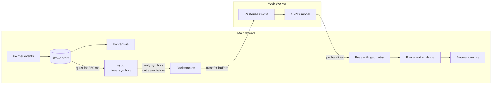

# CalcInk architecture

This document explains how CalcInk is built and why. Every number in it was measured on this
codebase, and the section that quotes a number says how.

1. [Overview](#1-overview)
2. [Model selection](#2-model-selection)
3. [From strokes to an answer](#3-from-strokes-to-an-answer)
4. [Drawing](#4-drawing)
5. [Keeping the main thread free](#5-keeping-the-main-thread-free)
6. [The math engine](#6-the-math-engine)
7. [Working offline](#7-working-offline)
8. [Measured performance and memory](#8-measured-performance-and-memory)
9. [Tests](#9-tests)
10. [Limitations](#10-limitations)

## 1. Overview

CalcInk is a notebook page that does arithmetic. You write an expression by hand, end it with
`=`, and the answer is pencilled in beside it. Change the expression and the answer follows.
Nothing leaves the device: capture, recognition and evaluation all run in the browser.

The design follows from one decision: **ink is kept as vectors from the first pointer event to the
last step of recognition.** A stroke is a list of points, never a patch of pixels. Everything else
builds on that.

- Rendering scales the same points to any device pixel ratio, so ink is crisp on every screen.
- Erasing cuts strokes geometrically, so what is left is still exact stroke data.
- Grouping strokes into symbols is done with bounding boxes, with no image segmentation.
- The model's input is redrawn from the points at exactly the size and thickness the model was
  trained on, whatever size the user wrote at.



The code is organised the same way. Each folder is one stage and depends only on the ones before
it.

| Folder            | Responsibility                                                   | Browser APIs? |
| ----------------- | ---------------------------------------------------------------- | ------------- |
| `src/ink`         | Strokes, the stroke store, undo/redo, both erasers               | No            |
| `src/canvas`      | Coordinate conversion, canvas layers, pointer input, rendering   | Yes           |
| `src/layout`      | Grouping strokes into lines and symbols                          | No            |
| `src/recognition` | Rasterising, the worker, the model adapter, fusing with geometry | Worker only   |
| `src/math`        | Tokenizer, parser, evaluator, number formatting                  | No            |
| `src/app`         | The pipeline that connects the stages; scheduling; the app shell | Timers        |
| `src/ui`          | Toolbar and the answer overlay                                   | Yes           |

Four of the seven are pure functions with no browser dependency. That is deliberate: it is what
lets the eraser geometry, the layout rules, the rasteriser and the parser be tested exhaustively
in Node, and it is why the recognition path can be tested end to end against the real model
without opening a browser.

## 2. Model selection

### What the model has to do

The problem statement asks for recognition of 16 symbols (`0`–`9`, `+`, `−`, `×`, `÷`, `.`, `=`),
powered by an existing open-source pre-trained model that runs entirely in the browser. From that
and from the grading rubric we derived five requirements:

1. **Coverage.** As many of the 16 symbols as possible come from the model itself.
2. **Permissive licence.** MIT, Apache-2.0 or BSD, verified from the licence file in the source
   repository rather than from a badge or a description.
3. **Small.** The model is precached for offline use, so every megabyte is paid on first load.
4. **Fast on CPU.** It runs under WebAssembly in a worker. An equation of about eight symbols
   should be classified in well under 100 ms.
5. **Accurate on canvas ink.** Our input is strokes drawn with a mouse, finger or stylus. That is
   not the same distribution as scanned paper, and models trained on one do not automatically work
   on the other.

### Approach: classify symbols, not whole expressions

There are two families of model for this task. End-to-end models take an image of a whole
expression and emit LaTeX. Symbol classifiers take one isolated symbol and emit a label, leaving
segmentation and ordering to the application.

We chose a symbol classifier. Our ink is stored as vector strokes with known positions, so the
hard part of the end-to-end problem (finding and ordering symbols in a bitmap) is something we can
do exactly, with geometry, for free. The expressions are a flat, one-line grammar with no
fractions or exponents, so we do not need a model to recover two-dimensional structure. And a
classifier's output is a probability per symbol, which is what the confidence indicator and the
re-evaluation cache both need. The end-to-end models we found (TrOCR-based math recognisers and
image-to-LaTeX transformers) are also autoregressive encoder–decoders that are far larger than a
small CNN, emit LaTeX that would need a second parser, and in several cases carry non-commercial
licences. We did not evaluate them further.

### Candidates

We searched Hugging Face, GitHub, the ONNX Model Zoo and Kaggle, kept every candidate that shipped
weights under a permissive licence, and measured them ourselves.

|                                 | Chosen: **altynbk** `cnn_aug`                                                                   | **Sagyam** `19_class`                                 | **kbss0000**                                                                                    | **mathex**                                                  | **ONNX Zoo** `mnist-12`                                     |
| ------------------------------- | ----------------------------------------------------------------------------------------------- | ----------------------------------------------------- | ----------------------------------------------------------------------------------------------- | ----------------------------------------------------------- | ----------------------------------------------------------- |
| Source                          | [altynbk/handwritten-math-recognition](https://github.com/altynbk/handwritten-math-recognition) | [Sagyam/hesv-api](https://github.com/Sagyam/hesv-api) | [kbss0000/Handwritten-Equation-Solver](https://github.com/kbss0000/Handwritten-Equation-Solver) | [devansh9837/mathex](https://github.com/devansh9837/mathex) | [onnx/models](https://huggingface.co/onnxmodelzoo/mnist-12) |
| Licence                         | MIT                                                                                             | MIT                                                   | MIT                                                                                             | MIT                                                         | MIT                                                         |
| Architecture                    | 4 × (Conv 3×3, BatchNorm, MaxPool), global average pool, dense                                  | MobileNetV2 backbone, dense 1024, dense               | 3 × (Conv 3×3, MaxPool), 3 dense                                                                | 2 × (Conv, MaxPool), 3 dense                                | 2 × (Conv, MaxPool), 1 dense                                |
| Parameters                      | 393,615                                                                                         | 3,594,323                                             | 162,418                                                                                         | 60,137                                                      | 5,998                                                       |
| Input                           | 64×64 grey                                                                                      | 100×100 RGB                                           | 32×32 grey                                                                                      | 28×28 grey                                                  | 28×28 grey                                                  |
| Our symbols covered             | **15 of 16** (all but `.`)                                                                      | **16 of 16**, plus `x y z`                            | 14 (no `=`, `.`)                                                                                | 13 (no `÷`, `=`, `.`)                                       | 10 (digits only)                                            |
| Size as ONNX                    | **1.58 MB**                                                                                     | 14.4 MB ¹                                             | 0.65 MB                                                                                         | 0.24 MB                                                     | 0.03 MB                                                     |
| WASM latency, 1 symbol ²        | 3.7 ms                                                                                          | not measured ¹                                        | 1.3 ms                                                                                          | 0.6 ms                                                      | 0.6 ms                                                      |
| WASM latency, 8 symbols ²       | 29 ms                                                                                           | not measured ¹                                        | 12 ms                                                                                           | 4.3 ms                                                      | 4.5 ms ³                                                    |
| Accuracy claimed by author      | 99.44%                                                                                          | none published                                        | "~95%"                                                                                          | 96.67%                                                      | 98.9% on MNIST                                              |
| **Accuracy on our benchmark ⁴** | **99.4%**                                                                                       | 98.2%                                                 | 84.5%                                                                                           | 64.7%                                                       | 57.4%                                                       |
| … digits only                   | 99.4%                                                                                           | 97.5%                                                 | 99.4% ⁵                                                                                         | 72.7%                                                       | 91.3%                                                       |
| … operators it supports         | 99.5%                                                                                           | 99.3%                                                 | 74.5%                                                                                           | 86.2%                                                       | n/a                                                         |

¹ Parameters × 4 bytes. We did not convert this model to ONNX, so there is no WASM timing. Its
compute per symbol is of the same order as the chosen model (roughly 60 M multiply-adds at
100×100, scaled from MobileNetV2's published figure at 224×224, against 57.8 M for the chosen
model), so we would expect similar latency at nine times the download.

² `onnxruntime-web` 1.30.0, WASM backend with SIMD, one thread, median of 100 runs after warm-up,
on an Intel Core i5-12450HX under Node 22. This is the same WebAssembly binary the browser loads.

³ This model has a fixed batch size of one, so eight symbols are eight separate calls.

⁴ The benchmark is the 1,608-image held-out test split of the altynbk repository: canvas-drawn
digits and operators, 15 classes. A symbol the model has no class for counts as wrong, which is
why digit-only models score low on the headline row. Each alternative was run through its own
documented preprocessing, and where its documentation was ambiguous we tried the plausible
variants and kept the best. **This benchmark favours the chosen model**, because it comes from
that model's own data. We use it because it is the closest available match to our real input,
strokes drawn on a canvas, and treat the gaps as indicative rather than exact.

⁵ Identical to the chosen model's digit score, which suggests this model was trained on images
that overlap the benchmark. Its digit figure is therefore optimistic. The same caution applies to
the Sagyam model: it was trained on the dataset the benchmark is drawn from, with a split we do
not know.

Three further candidates were rejected before measurement:

- **[Sagyam/Handwritten-Optical-Character-Recognition](https://github.com/Sagyam/Handwritten-Optical-Character-Recognition)**
  ships a ready-made TensorFlow.js model for exactly this task, but under GPL-3.0.
- **[MaciejCaputa/handwritten-mathematics-recogniser](https://github.com/MaciejCaputa/handwritten-mathematics-recogniser)**
  (MIT) is a two-layer perceptron whose weights are a 14.7 MB TypeScript literal. It has no `÷` or
  `=` class and the project has been unmaintained since 2018.
- **`TGrote11/Handwriting_Math_Classification`** on Hugging Face is a vision transformer with
  87.5 M parameters, and its model card declares no licence.

### Decision

We bundle **altynbk `cnn_aug`**, converted to ONNX.

- **Coverage.** It is the only small model that has both `÷` and `=`. It covers 15 of 16 symbols.
- **Accuracy.** It scored highest on the benchmark, and the margin over the general-purpose
  alternatives is large for operators, which is where digit-centric models are weakest.
- **Robustness.** The author trained it twice and published both results. The copy trained with
  augmentation (rotation, pen thickness, occlusion, noise) keeps 98.4% on perturbed test images
  where the unaugmented copy drops to 71.2%. We ship the augmented one. Pen thickness is exactly
  the variation a stroke-width slider introduces.
- **Size and speed.** 1.58 MB and 29 ms for a whole equation. The faster candidates are faster
  because they see less: 28×28 input cannot hold the two dots of a `÷`.
- **Domain match.** Its training images were drawn on an HTML canvas, like ours.

The runner-up is **Sagyam `19_class`**. It covers all 16 symbols and has the cleanest provenance of
any candidate (see below). We did not choose it because it is nine times larger and scored lower,
and because its one extra class, the decimal point, is better handled by geometry in any case.

### The decimal point

No small candidate has a `.` class, and we would not rely on one if it did. Every classifier here
crops a symbol to its bounding box and scales it to fill the input. For a decimal point that
discards the only thing that identifies it: that it is tiny and sits on the baseline. After
normalisation a dot is a filled blob indistinguishable from a small `0`.

So `.` is decided before the model is consulted, from the stroke's size relative to the line and
its vertical position. The other 15 symbols are classified by the model.
[Section 3](#combining-the-model-with-geometry) describes how geometry and model output are
combined for the remaining ambiguous cases.

### Provenance and licence check

We read the licence files ourselves. Two things are worth stating plainly.

**The weights are MIT-licensed.** The upstream repository has an MIT `LICENSE` file, copyright
Altynbek Kabiyev, reproduced in [`public/models/LICENSE.txt`](../public/models/LICENSE.txt).

**The training data is not what the upstream README says it is.** The README describes a
"self-collected dataset". The image files in that repository have the same names, class folders
and stray metadata file as the Kaggle dataset
[Handwritten Math Symbols](https://www.kaggle.com/datasets/sagyamthapa/handwritten-math-symbols)
by Sagyam Thapa, which Kaggle lists under **GPL-2**. We conclude the model was trained on a subset
of that dataset.

What this means for us: we redistribute the weights, which their author released under MIT, and
none of the images. Whether weights inherit the licence of their training data is not legally
settled. We consider the risk acceptable for this project and record it here rather than leave it
to be discovered. The same question applies to the alternatives: the other operator-capable
models were trained on this dataset or on data derived from CROHME, whose licence we did not
verify.

If a clean lineage is ever required, the swap is to Sagyam `19_class`: the dataset's own author,
licensing his own model under MIT. The model is loaded through an adapter that isolates the input
size, label list and normalisation, so the change would be confined to that adapter and the model
file.

### Conversion to ONNX

The upstream model is a Keras 3 `.keras` archive. `onnxruntime-web` needs ONNX.
[`scripts/model/convert_model.py`](../scripts/model/convert_model.py) reads the weight tensors out
of the archive and writes them, unchanged, into an equivalent ONNX graph. **No training,
fine-tuning or quantisation takes place.**

We built the graph by hand with `onnx.helper` instead of using a generic converter. The network is
sixteen layers, so this is about sixty lines, it has no dependency on TensorFlow, and every
operator in the output is one we chose. The 4.8 MB archive becomes a 1.58 MB file because the
archive also stores the optimiser's state, which inference does not need.

To prove the conversion is faithful, the script runs the upstream test split through the ONNX
model using the upstream preprocessing code. It classifies 1,599 of 1,608 images correctly:
0.9944029850746269, identical to the figure in the upstream `results/metrics.json`.

### What the model expects

Measured over all 8,036 upstream images after upstream preprocessing, to calibrate our own
rasteriser:

| Property     | Value                                                                            |
| ------------ | -------------------------------------------------------------------------------- |
| Tensor       | `[N, 1, 64, 64]` float32, ink = 1.0, background = 0.0                            |
| Framing      | Symbol cropped to its ink bounding box, centred in a square 1.3× its longer side |
| Ink extent   | 49–50 px of the 64 px frame (5th–95th percentile)                                |
| Stroke width | 3.0 px median (interquartile range 3.0–4.6 px)                                   |
| Output       | 15 probabilities: `0`–`9`, `add`, `div`, `eq`, `mul`, `sub`                      |

Stroke width in these images is not constant: it is the author's fixed pen width divided by how
much each symbol was shrunk to fit. A short minus sign is shrunk less than a tall digit and so
comes out thicker (5 px median against 3 px). Our rasteriser reproduces this by scaling the user's
actual pen width by the same factor it scales the symbol, clamped to the range the model was
trained on.

[`scripts/model/README.md`](../scripts/model/README.md) has the exact commands and commit hashes to
reproduce every number in this section.

## 3. From strokes to an answer

This is the path from raw pointer coordinates to a number on the page. Each step is a pure
function of the one before.

### Step 1: strokes

A stroke is an immutable list of `{x, y, pressure}` points in CSS pixels, plus the pen width it was
drawn with and a unique, increasing id. Immutability is load-bearing. "Editing" a stroke means
removing it and adding a replacement with a new id, so an id always refers to exactly the same
ink. Caching and change detection downstream both rest on that.

### Step 2: lines

The page is one unstructured set of strokes; nothing says which belong together. Strokes are
grouped into lines of writing, and each line is one equation.

Two strokes are on the same line if the smaller one's centre lies within the larger one's vertical
band and they are not too far apart horizontally. Lines are the connected components of that
relation, found with union-find. Comparing neighbours pairwise, instead of fitting strokes to
fixed rows, means a line can drift up or down the page as real handwriting does and still hold
together link by link. Comparing the _centre_ of one against the _band_ of the other is what keeps
stacked lines apart, since digits on adjacent lines may overlap by a few pixels but the centre of
one is never inside the other. The result does not depend on the order strokes were drawn in.

A second pass rejoins fragments on the same row, judging gaps against the line's digit height
instead of the two neighbouring strokes. Without it, erasing the `3` from `4 × 3 =` would orphan
the `=`: `×` and `=` are both short, and the hole between them is wider than either.

### Step 3: symbols

Within a line, strokes are merged into symbols by **horizontal overlap**. The strokes of one
symbol sit on top of each other: the two bars of `+`, the diagonals of `×`, the bars of `=`, the
stem and flag of `4`. The strokes of neighbouring symbols sit side by side. Two strokes that share
at least 40% of the narrower one's width are one symbol.

Dots are handled separately, because overlap gives the wrong answer for them in both directions:

- A decimal point written under the overhang of a `7` overlaps it horizontally but is not part of
  it. So a mark no larger than 22% of the line height is set aside before merging.
- The dots of `÷` overlap nothing but belong to their bar. So a dot directly above or below a
  lone flat stroke is attached to it, at most one on each side.

Every symbol gets a key: the ids of its strokes. Because strokes are immutable and ids are never
reused, two symbols with the same key are guaranteed to be the same ink.

### Step 4: stroke coordinates to tensor

The model wants one 64×64 greyscale image per symbol. We do **not** read pixels back from the
canvas. Each symbol is redrawn from its stroke coordinates straight into a `Float32Array`
([`rasterize.ts`](../src/recognition/rasterize.ts)):

1. **Frame.** Take the bounding box of the symbol's points. Scale it uniformly so the ink's longer
   side spans 64 / 1.3 ≈ 49.2 px, and centre it. The aspect ratio is kept, so a `1` stays narrow
   and a `−` stays flat. This is the framing the model was trained with.
2. **Stroke width.** Scale the user's actual pen width by the same factor, then clamp it to
   2–5.5 px, the range in the training images. A pen setting of 2.5 or 9 px therefore produces
   input the model has seen.
3. **Rasterise.** For every pixel near a segment, compute its distance to the segment and set
   the pixel to `clamp(radius + 0.5 − distance, 0, 1)`. That is 1 inside the stroke, 0 outside,
   and a one-pixel ramp across the edge, which is the anti-aliasing. Overlapping segments keep
   the larger value, so joints and crossings are no brighter than the rest of the line.
4. **Batch.** All symbols of a request are written into one buffer and sent to the model as a
   single `[N, 1, 64, 64]` tensor.

Redrawing from vectors is what makes recognition independent of things that have nothing to do
with what was written: device pixel ratio, browser zoom, ink colour, the paper grid, the answer
drawn next to the equation, and the size of the handwriting. A test confirms the model reads every
symbol identically at handwriting sizes from 24 px to 320 px and at pen widths across the whole
range of the size slider, 1.5 px to 12 px.

### Combining the model with geometry

Normalising a symbol to fill the frame is what makes the model insensitive to size. It is also
what the model cannot see past: the image no longer says how big the symbol was, where on the line
it sat, or how many strokes it had. Geometry knows exactly those things.

The two are combined as independent evidence
([`interpret.ts`](../src/recognition/interpret.ts)). The model gives P(symbol | image). Geometry
classifies the stroke arrangement and supplies a weight per symbol, standing for
P(arrangement | symbol). The product, renormalised, is the final distribution, and its largest
value is the confidence shown to the user.

| Stroke arrangement                     | Weight on the matching symbol | Weight on the others  |
| -------------------------------------- | ----------------------------- | --------------------- |
| One flat stroke                        | `−` × 1                       | × 0.05                |
| Two flat strokes, stacked              | `=` × 1                       | × 0.05                |
| A flat stroke with a dot above / below | `÷` × 1                       | × 0.1                 |
| Anything else                          | × 1                           | `−` × 0.05, `=` × 0.2 |

The weights are soft on purpose. A weight of 0.05 does not forbid a reading; it means the model
must be twenty times surer of it to win. Geometry scales the model's opinion and never replaces
it. All 15 of these classes are always the model's call.

The decimal point is the one exception, for the reason given in section 2: a lone dot is never
sent to the model. It is read as `.` with high confidence when it sits in the lower part of the
line and with low confidence when it floats higher up, where it is more likely a stray mark.

### Step 5: evaluate and draw

The readings are joined into a string with one character per symbol, such as `18+4×3=`. If it ends
with `=` it is evaluated (section 6); otherwise the line is still being written and nothing is
shown. Because one character is one symbol, an error position from the parser is also the index
of the stroke group at fault, which is how the interface underlines the right place.

The answer is drawn on the overlay canvas immediately to the right of the `=`, at the size of
the handwriting.

## 4. Drawing

### Three canvases

| Layer   | Holds                                    | Redrawn                                  |
| ------- | ---------------------------------------- | ---------------------------------------- |
| Ink     | Finished strokes                         | Only when the page changes               |
| Live    | The stroke under the pen; the eraser tip | Every frame while a pointer is down      |
| Overlay | Answers, doubts, error notes             | When an equation changes or is animating |

The split keeps the per-frame cost of writing constant. While the pen is down, a frame clears and
fills one path on the live layer, however much ink is already on the page. When the pen lifts,
the finished stroke is painted onto the ink layer once and the live layer is cleared. A newly
added stroke is painted incrementally; only removals (erase, undo) trigger a full redraw, and that
is a single `fill` per stroke because each stroke's `Path2D` is cached.

The paper grid is a CSS background, not canvas drawing. It costs nothing per frame.

There is no standing render loop. A frame is requested only when something changed, and at most
once per display refresh however many pointer events arrive.

### High-DPI displays

Strokes are stored in CSS pixels. The canvas backing store is `CSS size × devicePixelRatio`, and
the context is scaled by that ratio once, so drawing code works in CSS pixels and never mentions
the ratio. Three details matter:

- A canvas cannot have fractional pixels, so at ratios such as 1.25 the backing store is rounded
  and the true scale differs slightly from the nominal one. Drawing uses the true scale.
- `ResizeObserver`'s `devicePixelContentBoxSize` gives the exact device-pixel size and is used to
  settle that rounding. It is trusted only when it agrees with the ratio to within a pixel,
  because under device emulation it reports unscaled pixels. Trusting it blindly produced a
  half-resolution canvas in testing.
- The ratio can change with no change in CSS size (dragging the window to another monitor), so a
  `matchMedia` listener for the current resolution triggers a resize as well.

### Input

Pointer Events give one code path for mouse, touch and stylus.

- **Coalesced events.** A pen can report at 240 Hz while the display refreshes at 60. The browser
  batches the extra samples into one event; `getCoalescedEvents()` recovers them, for a smoother
  curve.
- **Pointer capture** keeps a stroke going if the pointer leaves the canvas.
- **Palm rejection.** Touches are ignored for 400 ms after a pen lifts, and only one pointer draws
  at a time.
- The eraser end of a stylus erases without changing tool.
- The live canvas asks for a `desynchronized` context, which lets the browser present it without
  waiting for the compositor.

### Smooth ink

Sampled points are turned into an outline polygon by
[perfect-freehand](https://github.com/steveruizok/perfect-freehand) (MIT), which smooths them and
varies the width with real pressure when the device reports it and with drawing speed when it does
not. The polygon is filled through quadratic curves between its vertices, so the edge has no
facets at any zoom.

### Erasing and undo

Both erasers are geometry ([`eraser.ts`](../src/ink/eraser.ts)). The stroke eraser tests the
distance from the eraser's swept path to each stroke. The pixel eraser removes only the part of a
stroke under the sweep and returns the surviving pieces as new strokes, cutting exactly at the
eraser's edge. Because pointer samples can be far apart on a fast stroke, segments near the
eraser are subdivided first so a small eraser cannot slip between two samples.

Undo uses the command pattern with a single command. Every operation is "these strokes leave,
these arrive": drawing adds one, erasing removes some, pixel-erasing swaps a stroke for its
fragments, and clearing removes all. Undo is the same command reversed. The many store changes of
one eraser drag are folded into one undo step.

## 5. Keeping the main thread free

The frame budget at 60 FPS is 16.7 ms. Three mechanisms keep recognition out of it.

### A worker does the heavy work

Rasterising and inference both run in a Web Worker
([`worker.ts`](../src/recognition/worker.ts)). The main thread sends stroke coordinates and
receives probabilities.

Strokes cross the boundary as four flat typed arrays, and their buffers are **transferred**, not
copied: ownership of the memory moves to the worker and the sender's view becomes empty. A test
asserts exactly that. The worker reads each stroke through a `subarray` view, so unpacking copies
nothing either.

The runtime is `onnxruntime-web`'s WASM backend with one thread. Multi-threaded WASM needs
cross-origin isolation headers that static hosts such as GitHub Pages cannot send, and at 3.7 ms
per symbol this model does not need the threads. The WASM binary is loaded from the app's own
bundle, never from a CDN.

### Read the page only when it is quiet

Recognition does not run after every stroke. A `4` is two strokes, and reading the page between
them would flash a wrong answer. Each change restarts a 350 ms timer; the page is read when it
expires. While the pen is down the timer is held, however long the stroke takes
([`IdleScheduler.ts`](../src/app/IdleScheduler.ts)).

### Never classify the same ink twice

Model output is cached against each symbol's key. Since a key names immutable strokes, a cached
result can never be wrong. Rewriting one digit of a ten-symbol equation sends one symbol to the
model, and undoing an erase sends none.

### Stale results

The user can keep writing while a request is in flight. Each line of writing is given an identity
that survives editing, by matching it to the previous line it shares the most strokes with, and a
version that increases whenever its ink changes
([`equations.ts`](../src/app/equations.ts)). Every request is tagged with the `(id, version)` of
each equation it serves. When the reply arrives, an equation whose version has moved on is
skipped, since its newer version has its own request on the way.

The probabilities in a stale reply are still kept. They describe strokes, and strokes do not
change, so they go into the cache and may save the next request the work.

What is left on the main thread is layout, cache lookups and evaluation, all synchronous and
cheap. It is wrapped in a User Timing measure, `calcink:read-page`, so its cost is visible in the
Performance panel. Section 8 gives the figures.

## 6. The math engine

Three pure stages: tokenize, parse, evaluate. There is no `eval` and no `Function` constructor
anywhere in the codebase, and ESLint is configured to fail the build if one is introduced.

```
expression := term   (('+' | '−') term)*
term       := unary  (('×' | '÷') unary)*
unary      := '−' unary | primary
primary    := NUMBER | '(' expression ')'
```

The parser is recursive descent with one function per rule. Precedence comes from the nesting:
`expression` calls `term`, so multiplication binds tighter than addition. Both loops consume left
to right, which is what makes `8 − 3 − 2` equal 3 and not 7.

**Nothing throws.** Every failure is a return value carrying an error code, a message, and the
index of the symbol at fault.

- Division by zero is reported the moment it is seen, as `Undefined`. Letting `Infinity` flow
  upwards would turn `1 ÷ 0 × 0` into a bare `NaN` with nothing left to say why.
- The evaluator walks the tree with an explicit stack instead of recursion. A long chain such as
  `1+1+1+…` parses into a tree one level deep per term, and a few thousand levels of recursion
  would overflow the call stack: an exception on harmless input.
- Nesting depth is capped at 200 for the same reason.
- A result too large for a double is reported as such instead of printed as `Infinity`.

**Display.** Binary floating point cannot represent most decimal fractions, so `0.1 + 0.2` is
really 0.30000000000000004. Results are rounded to 10 significant digits, which removes that noise
while keeping more precision than anyone writes by hand, and trailing zeros are dropped.

The grammar accepts parentheses although the bundled model has no class for them. They cost a few
lines, the tests cover them, and a model that could read them would need no parser change.

## 7. Working offline

A service worker generated by `vite-plugin-pwa` (Workbox) precaches every file the app can
request: the HTML, scripts, styles, the font, the icons, the model and the WASM runtime. That is
16 files and 16.0 MB, of which 14.2 MB is the ONNX runtime (3.7 MB over the wire with gzip).

After one online visit the app loads and recognises with no network at all. It tells the user
when that point is reached, with a note at the foot of the page.

Verified by loading the production build once, switching the browser context offline, reloading,
writing `18+4×3=` and reading back 30, with no failed request. During the online load all 13
requests went to the app's own origin. There is no third-party request of any kind: no CDN, no
analytics, no font service.

## 8. Measured performance and memory

Measured on the production build served locally, in Microsoft Edge (headless) on an Intel Core
i5-12450HX, driven by a script that writes with synthetic pointer input. Real-device figures will
differ; these establish that nothing in the architecture blocks the main thread.

### Frame rate while recognition runs

A page already holding five equations, then two more written symbol by symbol with a 400 ms pause
after each, so that recognition fires 23 times and each next stroke begins while the worker is
still busy.

| Metric                                     | Result                      |
| ------------------------------------------ | --------------------------- |
| Frames sampled (with the pen down)         | 2,763 (1,063)               |
| Longest frame                              | 14.0 ms                     |
| Frames over 16.7 ms                        | 0                           |
| Long tasks (over 50 ms) on the main thread | 0                           |
| Main-thread cost of reading the page       | 1.4 ms median, 2.9 ms worst |
| Worker time for a new symbol               | about 20 ms                 |

### Inference

From the model benchmark in section 2, under the same WASM runtime: 3.7 ms for one symbol and
29 ms for a batch of eight, single-threaded. On a fresh page load the first answer appeared 2.7 s
after the first stroke began; that includes writing the expression and the runtime finishing its
start-up.

### Memory

Forty cycles of: write three equations, wait for answers, pixel-erase through one, stroke-erase
through another, undo twice, redo, clear. Heap sizes are taken after a forced garbage collection.

| After     | Main-thread JS heap | DOM nodes | Event listeners |
| --------- | ------------------- | --------- | --------------- |
| Warm-up   | 2.60 MB             | 115       | 51              |
| 10 cycles | 3.50 MB             | 115       | 51              |
| 20 cycles | 3.68 MB             | 115       | 51              |
| 30 cycles | 3.72 MB             | 115       | 51              |
| 40 cycles | 3.69 MB             | 115       | 51              |

The early rise is the undo history filling. It is capped at 500 steps, each cycle adds about 40,
and once the cap is reached the heap is flat.

The worker's JS heap went from 1.99 MB to 2.08 MB across 61 recognition requests on ink it had
never seen. The WASM runtime's own linear memory is not visible to this measurement and was not
measured.

Creating and destroying the whole app 30 times left event listeners, DOM nodes and worker count
exactly at their baseline.

What makes that hold:

- Tensors are disposed after every inference, input and output both.
- Typed-array buffers are transferred to the worker, so no copy is left behind on either side.
- Per-stroke caches (render paths, layout measurements) are `WeakMap`s keyed by the stroke, so an
  entry is collected with its stroke once that has been erased and has left the undo history.
- The recognition cache is pruned back to what is on the page once it outgrows it.
- Every listener, observer, timer and animation frame is released in a `destroy()` method, and
  development hot-reload calls it on every edit, which exercises that path constantly.

## 9. Tests

366 tests in 16 files, run with Vitest in Node. `npm test` takes about two seconds.

| Area              | Tests | What is covered                                                                                                                                                           |
| ----------------- | ----- | ------------------------------------------------------------------------------------------------------------------------------------------------------------------------- |
| Math engine       | 89    | Precedence, associativity, unary minus, decimals, division by zero, malformed input, display rounding. A fuzz test evaluates 2,000 random strings and asserts none throws |
| Coordinates       | 50    | CSS ↔ device pixels at nine pixel ratios, backing-store rounding, client ↔ page conversion                                                                                |
| Layout            | 36    | Symbol grouping, multi-stroke symbols, dots, line grouping, drift, drawing-order independence                                                                             |
| Ink               | 38    | Undo/redo stack behaviour, gesture folding, both erasers                                                                                                                  |
| Rasteriser        | 22    | Framing, centring, aspect ratio, stroke width clamping, degenerate input                                                                                                  |
| Model integration | 30    | The bundled ONNX model on our rasteriser: every symbol, five handwriting sizes, six pen widths across the slider's range                                                  |
| Geometry fusion   | 21    | Stroke arrangements, fusion weights, the decimal point                                                                                                                    |
| Pipeline          | 50    | Debouncing, caching, stale-result discarding, re-evaluation on edit, worker protocol                                                                                      |
| Answer overlay    | 12    | What is written after the "=", how dark, and that the doubt mark fits inside the write-on reveal and on the page                                                          |
| Tool sizes        | 18    | Snapping and stepping the pen and eraser sizes, and where the size panel opens in the wide and the narrow layout                                                          |

Two choices are worth noting. Layout and recognition are tested with **synthetic handwriting**: a
fixture that turns a string such as `7.5÷2-60=` into stroke paths with controllable size, spacing
and wobble, so tests are exact and repeatable. And the model integration tests run the **real
model** under the same WASM runtime the browser uses, so a change to the rasteriser that degraded
recognition would fail the build.

## 10. Limitations

- **Accuracy has been measured on synthetic handwriting and on the model's own test set, not on
  a study of real users.** The model's training data came from a small number of writers.
- **Symbols must not overlap horizontally.** Segmentation is by horizontal overlap, so digits
  written touching or on top of each other are read as one symbol. Cursive-style joined digits
  are not supported.
- **One line per equation.** Fractions, exponents and expressions that wrap are out of scope.
- **No parentheses.** The parser handles them; the model has no class for them.
- **A dot is only ever a decimal point.** A stray speck low on the line will be read as one.
- **The answer does not avoid ink.** It is drawn to the right of the `=`, or below the line when
  it would run off the page; it does not check for other writing there.
- **The page does not scroll.** It is one screen of paper.
- **WASM runtime size.** The 14 MB runtime is far larger than the 1.6 MB model it runs. A
  hand-written forward pass for this four-layer network would be a few kilobytes; we judged a
  maintained runtime the better engineering trade.
